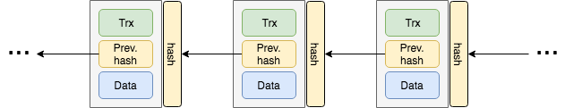
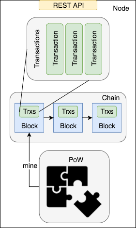
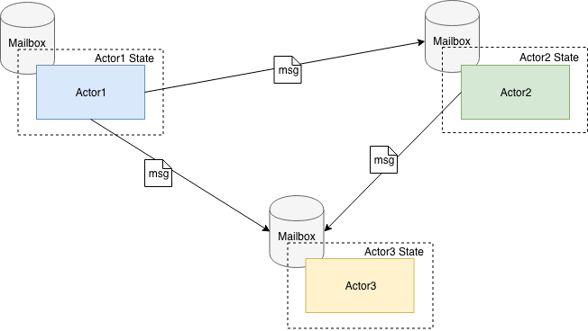
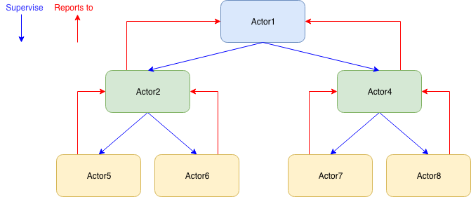

Scalachain is a blockchain built using the Scala programming language and the actor model ([Akka Framework](https://akka.io/)).

In this story I will show the development process to build this simple prototype of a blockchain. This means that the project is not perfect, and there may be better implementations. For all these reasons any contribution — may it be a suggestion, or a PR on the GitHub [repository](https://github.com/elleFlorio/scalachain) — is very welcome! :-)


Let’s start with a little introduction to the blockchain. After that we can define the simplified model that we will implement.

### Quick Introduction to the blockchain
There a lot of good articles that explain how a blockchain works, so I will do a high level introduction just to provide some context to this project.

The blockchain is a **distributed ledger**: it registers some transaction of values (like coins) between a sender and a receiver. What makes a blockchain different from a traditional database is the decentralized nature of the blockchain: it is distributed among several communicating nodes that guarantee the validity of the transactions registered.

The blockchain stores transactions in blocks, that are created —we say **mined** — by nodes investing computational power. Every block is created by solving a cryptographic puzzle that is hard to solve, but easy to verify. In this way, every block represents the work needed to solve such puzzle. This is the reason why the cryptographic puzzle is called the **Proof of Work**: the solution of the puzzle is the proof that a node spent a certain amount of work to solve it and mine the block.

Why do nodes invest computational power to mine a block? Because the creation of a new block is rewarded by a predefined amount of coins. In this way nodes are encouraged to mine new blocks, contributing in the growth and strength of the blockchain.



The solution of the Proof Of Work depends on the values stored in the last mined block. In this way every block is chained to the previous one. This means that, to change a mined block, a node should mine again all the blocks above the modified one. Since every block represents an amount of work, this operation would be unfeasible once several blocks are mined upon the modified one. This is the foundation of the **distributed** **consensus**, The agreement of all the nodes on the validity of the blocks (that is the transactions) stored in the blockchain.

It may happen that different nodes mine a block at the same time, creating different “branches” from the same blockchain — this is called a **fork** in the blockchain. This situation is solved when a branch becomes longer than the others: the longest chain always wins, so the winning branch becomes the new blockchain.

### The blockchain model
Scalachain is based on a blockchain model that is a simplification of the Bitcoin one.

The main components of our blockchain model are the Transaction, the Chain, the Proof of Work (PoW) algorithm, and the Node. The transactions are stored inside the blocks of the chain, that are mined using the PoW. The node is the server that runs the blockchain.



**Transaction**
Transactions register the movement of coins between two entities. Every transaction is composed by a sender, a recipient, and an amount of coin. Transactions will be registered inside the blocks of our blockchain.

**Chain**
The chain is a linked list of blocks containing a list of transactions. Every block of the chain has an index, the proof that validates it (more on this later), the list of transactions, the hash of the previous block, the list of previous blocks, and a timestamp. Every block is chained to the previous one by its hash, that is computed converting the block to a `JSON` string and then hashing it through a `SHA-256` hashing function.

**PoW**
The PoW algorithm is required to mine the blocks composing the blockchain. The idea is to solve a cryptographic puzzle that is hard to solve, but easy to verify having the proof. The PoW algorithm that is implemented in Scalachain is similar to the Bitcoin one (based on [Hashcash](https://en.wikipedia.org/wiki/Hashcash)). It consists in finding a hash with N leading zeros, that is computed starting from the hash of the last block and a number, that is the proof of our algorithm.

We can formalize it as:
```
NzerosHash = SHA-256(previousNodeHash + proof
```
The higher is N, the harder is to find the proof. In Scalachain N=4 (It will be configurable eventually).

**Node**
The Node is the server running our blockchain. It provides some REST API to interact with it and perform basic operations such as send a new transaction, get the list of pending transactions, mine a block, and get the current status of the blockchain.

### Blockchain implementation in Scala
We are going to implement the defined model using the Scala Programming Language. From an high level view, the things we need to implement a blockchain are:

* transactions

* the chain of blocks containing lists of transactions

* the PoW algorithm to mine new blocks

These components are the essential parts of a blockchain.

**Transaction**
The transaction is a very simple object: it has a sender, a recipient and a value. We can implement it as a simple `case class`.
```scala
case class Transaction(sender: String, recipient: String, value: Long)
```

**Chain**
The chain is the core of our blockchain: it is a linked list of blocks containing transactions.
```scala
sealed trait Chain {

  val index: Int
  val hash: String
  val values: List[Transaction]
  val proof: Long
  val timestamp: Long
}
```

We start by creating a `sealed trait` that represents the block of our chain. The `Chain` can have two types: it can be an `EmptyChain` or a `ChainLink`. The former is our block zero (the *genesis block*), and it is implemented as a singleton (it is a `case object`), while the latter is a regular mined block.
```scala
case class ChainLink(index: Int, proof: Long, values: List[Transaction], previousHash: String = "", tail: Chain = EmptyChain, timestamp: Long = System.currentTimeMillis()) extends Chain {
  val hash = Crypto.sha256Hash(this.toJson.toString)
}

case object EmptyChain extends Chain {
  val index = 0
  val hash = "1"
  val values = Nil
  val proof = 100L
  val timestamp = System.currentTimeMillis()
}
```

Let’s look more in detail at our chain. It provides an index, that is the current height of the blockchain. There is the list of `Transaction`, the proof that validated the block, and the timestamp of the block creation. The hash value is set to a default one in the `EmptyChain`, while in the `ChainLink` it is computed converting the object to its `JSON` representation and hashing it with an utility function (see the `crypto` package in the [repository](https://github.com/elleFlorio/scalachain)). The `ChainLink` provides also the hash of the previous block in the chain (our link between blocks). The tail field is a reference to the previously mined blocks. This may not be the most efficient solution, but it is useful to see how the blockchain grows in our simplified implementation.

We can improve our `Chain` with some utilities. We can add it a *companion object *that defines an `apply` method to create a new chain passing it a list of blocks. A companion object is like a “set of static methods” — doing an analogy with Java — that has complete access rights on the fields and methods of the class/trait.
```scala
object Chain {
  def apply[T](b: Chain*): Chain = {
    if (b.isEmpty) EmptyChain
    else {
      val link = b.head.asInstanceOf[ChainLink]
      ChainLink(link.index, link.proof, link.values, link.previousHash, apply(b.tail: _*))
    }
  }
}
```

If the list of blocks is empty, we simply initialize our blockchain with an `EmptyChain`. Otherwise we create a new `ChainLink` adding as a tail the result of the apply method on the remaining blocks of the list. In this way the list of blocks is added following the order of the list.

It would be nice to have the possibility to add a new block to our chain using a simple addition operator, like the one we have on `List`. We can define our own addition operator `::` inside the `Chain` trait.
```scala
sealed trait Chain {

  val index: Int
  val hash: String
  val values: List[Transaction]
  val proof: Long
  val timestamp: Long

  def ::(link: Chain): Chain = link match {
    case l:ChainLink => ChainLink(l.index, l.proof, l.values, this.hash, this)
    case _ => throw new InvalidParameterException("Cannot add invalid link to chain")
  }
}
```

We pattern match on the block that is passed as an argument: if it is a valid `ChainLink` object we add it as the head of our chain, putting the chain as the tail of the new block, otherwise we throw an exception.

**PoW**
The PoW algorithm is fundamental for the mining of new blocks. We implement it as a simple algorithm:

1. Take the hash of the last block and a number representing the proof.

2. Concatenate the hash and the proof in a string.

3. hash the resulting string using the `SHA-256` algorithm.

4. check the 4 leading characters of the hash: if they are four zeros return the proof.

5. otherwise repeat the algorithm increasing the proof by one.

This a simplification of the [HashCash](https://en.wikipedia.org/wiki/Hashcash) algorithm used in the Bitcoin blockchain.

Since it is a recursive function, we can implement it as a tail recursive one to improve the usage of resources.
```scala
object ProofOfWork {

  def proofOfWork(lastHash: String): Long = {
    @tailrec
    def powHelper(lastHash: String, proof: Long): Long = {
      if (validProof(lastHash, proof))
        proof
      else
        powHelper(lastHash, proof + 1)
    }

    val proof = 0
    powHelper(lastHash, proof)
  }

  def validProof(lastHash: String, proof: Long): Boolean = {
    val guess = (lastHash ++ proof.toString).toJson.toString
    val guessHash = Crypto.sha256Hash(guess)
    (guessHash take 4) == "0000"
  }
}
```

The `validProof` function is used to check if the proof we are testing is the correct one. The `powHelper` function is a helper function that executes our loop using tail recursion, increasing the proof at each step. The `proofOfWork` function wrap all the things up, and is exposed by the `ProofOfWork` object.

### The actor model
The actor model is a programming model designed for **concurrent processing**, **scalability**, and **fault tolerance**. The model defines the atomic elements that compose the software systems — the **actors** — and the way this elements interact between them. In this project we will use the actor model implemented in Scala by the Akka Framework.



**Actor**
The actor is the atomic unit of the actor model. it is a computational unit that can send and receive messages. Every actor has an internal **private** state and a mailbox. When an actor receives and compute a message, it can react in 3 ways:

* Send a message to another actor.

* Change its internal state.

* Create another actor.

Communication is **asynchronous**, and messages are popped out from the mailbox and processed in series. To enable the parallel computation of messages you need to create several actors. Many actors together crate an **actor system**. The behavior of the application arises from the interaction between actors providing different functionalities.

**Actors are independent**
Actors are independent one to another, and they do not share their internal state. This fact has a couple of important consequences:

1. Actors can process messages **without side-effects** one to another.

2. It’s not important where an actor is — be it your laptop, a sever, or in the cloud — once we know its address we can request its services sending it a message.

The first point makes concurrent computation very easy. We can be sure that the processing of a message will not interfere with the processing of another one. To achieve **concurrent processing** we can deploy several actors able to process the same kind of message.

The second point is all about **scalability**: we need more computational power? No problem: we can start a new machine and deploy new actors that will join the existing actor system. Their mailbox addresses will be discoverable by existing actors, that will start communicate with them.

**Actors are supervised**
As we said in the description of the actor, one of the possible reaction to a message is the creation of other actors. When this happens, the father becomes the *supervisor* of its children. If a children fails, the supervisor can decide the action to take, may it be create a new actor, ignore the failure, or throw it up to its own supervisor. In this way the Actor System becomes a hierarchy tree, each node supervising its children. This is the way the actor model provides **fault tolerance**.



### Broker, a simple actor
The first actor we are going to implement is the Broker Actor: it is the manager of the transactions of our blockchain. Its responsibilities are the addition of new transactions, and the retrieval of pending ones.

The Broker Actor reacts to three kind of messages, defined in the `companion object` of the Broker class:
```scala
object Broker {
  sealed trait BrokerMessage
  case class AddTransaction(transaction: Transaction) extends BrokerMessage
  case object GetTransactions extends BrokerMessage
  case object Clear extends BrokerMessage

  val props: Props = Props(new Broker)
}
```

We create a trait `BrokerMessage` to identify the messages of the Broker Actor. Every other message will extend this trait. `AddTransaction` adds a new transaction to the list of pending ones. `GetTransaction` retrieve the pending transactions, and `Clear` empties the list. The `props` value is used to initialize the actor when it will be created.
```scala
class Broker extends Actor with ActorLogging {
  import Broker._

  var pending: List[Transaction] = List()

  override def receive: Receive = {
    case AddTransaction(transaction) => {
      pending = transaction :: pending
      log.info(s"Added $transaction to pending Transaction")
    }
    case GetTransactions => {
      log.info(s"Getting pending transactions")
      sender() ! pending
    }
    case Clear => {
      pending = List()
      log.info("Clear pending transaction List")
    }
  }
}
```

The Broker `class` contains the business logic to react to the different messages. I won’t go into the details because it is trivial. The most interesting thing is how we respond to a request of the pending transactions. We send them to the `sender()` of the `GetTransaction` message using the `tell` (`!`) operator. This operator means “send the message and don’t wait for a response” — aka fire-and-forget.

### Miner, an actor with different states
The Miner Actor is the one mining new blocks for our blockchain. Since we don’t want mine a new block while we are mining another one, the Miner Actor will have two states: ready, when it is `ready` to mine a new block, and `busy`, when it is mining a block.

Let’s start by defining the `companion object` with the messages of the Miner Actor. The pattern is the same, with a sealed trait — `MinerMessage` — used to define the kind of messages this actor reacts to.
```scala
object Miner {
  sealed trait MinerMessage
  case class Validate(hash: String, proof: Long) extends MinerMessage
  case class Mine(hash: String) extends MinerMessage
  case object Ready extends MinerMessage

  val props: Props = Props(new Miner)
}
```

The `Validate` message asks for a validation of a proof, and pass to the Miner the hash and the proof to check. Since this component is the one interacting with the PoW algorithm, it is its duty to execute this check. The `Mine` message asks for the mining starting from a specified hash. The last message, `Ready`, triggers a state transition.

**Same actor, different states**
The peculiarity of this actor is that it reacts to the messages according to its state: `busy` or `ready`. Let’s analyze the difference in the behavior:

* **busy**: the Miner is busy mining a block. If a new mining request comes, it should deny it. If it is requested to be ready, the Miner should change its state to the ready one.

* **ready**: the Miner is idle. If a mining request come, it should start mining a new block. If it is requested to be ready, it should say: “OK, I’m ready!”

* **both**: the Miner should be always available to verify the correctness of a proof, both in a ready or busy state.

Time so see how we can implement this logic in our code. We start by defining the common behavior, the validation of a proof.
```scala
def validate: Receive = {
    case Validate(hash, proof) => {
      log.info(s"Validating proof $proof")
      if (ProofOfWork.validProof(hash, proof)){
        log.info("proof is valid!")
        sender() ! Success
      }
      else{
        log.info("proof is not valid")
        sender() ! Failure(new InvalidProofException(hash, proof))
      }
    }
  }
```

We define a function `validate` that reacts to the `Validate` message: if the proof is valid we respond to the sender with a success, otherwise with a failure. The `ready` and the `busy` states are defined as functions that “extends” the `validate` one, since that is a behavior we want in both states.
```scala
def ready: Receive = validate orElse {
    case Mine(hash) => {
      log.info(s"Mining hash $hash...")
      val proof = Future {(ProofOfWork.proofOfWork(hash))}
      sender() ! proof
      become(busy)
    }
    case Ready => {
      log.info("I'm ready to mine!")
      sender() ! Success("OK")
    }
  }

  def busy: Receive = validate orElse {
    case Mine(_) => {
      log.info("I'm already mining")
      sender ! Failure(new MinerBusyException("Miner is busy"))
    }
    case Ready => {
      log.info("Ready to mine a new block")
      become(ready)
    }
  }
```

A couple of things to highlight here.

1. The state transition is triggered using the `become` function, provided by the Akka Framework. This takes as an argument a function that returns a `Receive` object, like the ones we defined for the `validation`, `busy`, and `ready` state.

2. When a mining request is received by the Miner, it responds with a `Future` containing the execution of the PoW algorithm. In this way we can work asynchronously, making the Miner free to do other tasks, such as the validation one.

3. The **supervisor** of this Actor controls the state transition. The reason of this choice is that the Miner is agnostic about the state of the system. It doesn’t know when the mining computation in the `Future` will be completed, and it can’t know if the block that it is mining has been already mined from another node. This would require to stop mining the current hash, and start mining the hash of the new block.

The last thing is to provide an initial state overriding the `receive` function.
```scala
override def receive: Receive = {
    case Ready => become(ready)
  }
```

We start waiting for a `Ready` message. When it comes, we start our Miner.

### Blockchain, a persistent actor
The Blockchain Actor interacts with the business logic of the blockchain. It can add a new block to the blockchain, and it can retrieve information about the state of the blockchain. This actor has another superpower: it can **persist** and recover the state of the blockchain. This is possible implementing the `PersistentActor` trait provided by the Akka Framework.
```scala

object Blockchain {
  sealed trait BlockchainEvent
  case class AddBlockEvent(transactions: List[Transaction], proof: Long) extends BlockchainEvent

  sealed trait BlockchainCommand
  case class AddBlockCommand(transactions: List[Transaction], proof: Long) extends BlockchainCommand
  case object GetChain extends BlockchainCommand
  case object GetLastHash extends BlockchainCommand
  case object GetLastIndex extends BlockchainCommand

  case class State(chain: Chain)

  def props(chain: Chain, nodeId: String): Props = Props(new Blockchain(chain, nodeId))
}
```

We can see that the `companion object` of this actor has more elements than the other ones. The `State` class is where we store the state of our blockchain, that is its `Chain`. The idea is to update the state every time a new block is created.

For this purpose, there are two different traits: `BlockchainEvent` and `BlockchainCommand`. The former is to handle the events that will trigger the persistence logic, the latter is used to send direct commands to the actor. The `AddBlockEvent` message is the event that will update our state. The `AddBlockCommand`, `GetChain`, `GetLastHash`, and `LastIndex` commands are the one used to interact with the underlying blockchain.

The usual `props` function initializes the Blockchain Actor with the initial `Chain` and the `nodeId` of the Scalachain node.
```scala
class Blockchain(chain: Chain, nodeId: String) extends PersistentActor with ActorLogging{
  import Blockchain._

  var state = State(chain)

  override def persistenceId: String = s"chainer-$nodeId"
  
  //Code...
}
```

The Blockchain Actor extends the trait `PersistentActor` provided by the Akka framework. In this way we have out-of-the-box all the logic required to persist and recover our state.

We initialize the state using the `Chain` provided as an argument upon creation. The `nodeId` is part of the `persistenceId` that we override. The persistence logic will use it to identify the persisted state. Since we can have multiple Scalachain nodes running in the same machine, we need this value to correctly persist and recover the state of each node.
```scala
def updateState(event: BlockchainEvent) = event match {
    case AddBlockEvent(transactions, proof) =>
      {
        state = State(ChainLink(state.chain.index + 1, proof, transactions) :: state.chain)
        log.info(s"Added block ${state.chain.index} containing ${transactions.size} transactions")
      }
  }
```

The `updateState` function executes the update of the Actor state when the `AddBlockEvent` is received.

```scala
override def receiveRecover: Receive = {
    case SnapshotOffer(metadata, snapshot: State) => {
      log.info(s"Recovering from snapshot ${metadata.sequenceNr} at block ${snapshot.chain.index}")
      state = snapshot
    }
    case RecoveryCompleted => log.info("Recovery completed")
    case evt: AddBlockEvent => updateState(evt)
  }
```

The `receiveRecover` function reacts to the recovery messages sent by the persistence logic. During the creation of an actor a persisted state (**snapshot**) may be offered to it using the `SnapshotOffer` message. In this case the current state becomes the one provided by the snapshot.

`RecoveryCompleted` message informs us that the recovery process completed successfully. The `AddBlockEvent` triggers the `updateState` function passing the event itself.
```scala
override def receiveCommand: Receive = {
    case SaveSnapshotSuccess(metadata) => log.info(s"Snapshot ${metadata.sequenceNr} saved successfully")
    case SaveSnapshotFailure(metadata, reason) => log.error(s"Error saving snapshot ${metadata.sequenceNr}: ${reason.getMessage}")
    case AddBlockCommand(transactions : List[Transaction], proof: Long) => {
      persist(AddBlockEvent(transactions, proof)) {event =>
        updateState(event)
      }

      // This is a workaround to wait until the state is persisted
      deferAsync(Nil) { _ =>
        saveSnapshot(state)
        sender() ! state.chain.index
      }
    }
    case AddBlockCommand(_, _) => log.error("invalid add block command")
    case GetChain => sender() ! state.chain
    case GetLastHash => sender() ! state.chain.hash
    case GetLastIndex => sender() ! state.chain.index
  }
```

The `receiveCommand` function is used to react to the direct commands sent to the actor. Let’s skip the `GetChain`, `GetLastHash`, and `GetLastIndex` commands, since they are trivial. The `AddBlockCommand` is the interesting part: it creates and fires an `AddBlock` event, that is persisted in the event journal of the Actor. In this way events can be replayed in case of recovery.

The `deferAsync` function waits until the state is updated after the processing of the event. Once the event has been executed the actor can save the snapshot of the state, and inform the sender of the message with the updated last index of the `Chain`. The `SaveSnapshotSucces` and `SaveSnapshotFailure` messages helps us to keep track of possible failures.

### Node, an actor to rule them all
The Node Actor is the backbone of our Scalachain node. It is the **supervisor** of all the other actors (Broker, Miner, and Blockchain), and the one communicating with the outside world through the REST API.
```scala
object Node {

  sealed trait NodeMessage

  case class AddTransaction(transaction: Transaction) extends NodeMessage

  case class CheckPowSolution(solution: Long) extends NodeMessage

  case class AddBlock(proof: Long) extends NodeMessage

  case object GetTransactions extends NodeMessage

  case object Mine extends NodeMessage

  case object StopMining extends NodeMessage

  case object GetStatus extends NodeMessage

  case object GetLastBlockIndex extends NodeMessage

  case object GetLastBlockHash extends NodeMessage

  def props(nodeId: String): Props = Props(new Node(nodeId))

  def createCoinbaseTransaction(nodeId: String) = Transaction("coinbase", nodeId, 100)
}
```

The Node Actor has to handle all the high level messages that coming from the REST API. This is the reason why we find in the `companion object` more or less the same messages we implemented in the children actors. The props function takes a nodeId as an argument to create our Node Actor. This will be the one used for the initialization of Blockchain Actor. The `createCoinbaseTransaction` simply creates a transaction assigning a predefined coin amount to the node itself. This will be the **reward** for the successful mining of a new block of the blockchain.
```scala
class Node(nodeId: String) extends Actor with ActorLogging {

  import Node._

  implicit lazy val timeout = Timeout(5.seconds)

  val broker = context.actorOf(Broker.props)
  val miner = context.actorOf(Miner.props)
  val blockchain = context.actorOf(Blockchain.props(EmptyChain, nodeId))

  miner ! Ready
  
  //Code...
}
```

Let’s look at the initialization of the Node Actor. The timeout value is used by the `ask` (`?`) operator (this will be explained shortly). All our actors are created in the actor `context`, using the `props` function we defined in each actor.

The Blockchain Actor is initialized with the `EmptyChain` and the `nodeId` of the Node. Once everything is created, we inform the Miner Actor to be ready to mine sending it a `Ready` message. Ok, we are now ready to receive some message and react to it.
```scala
override def receive: Receive = {
    case AddTransaction(transaction) => {
      //Code...
    }
    case CheckPowSolution(solution) => {
      //Code...
    }
    case AddBlock(proof) => {
      //Code...
    }
    case Mine => {
      //Code...
    }
    case GetTransactions => broker forward Broker.GetTransactions
    case GetStatus => blockchain forward GetChain
    case GetLastBlockIndex => blockchain forward GetLastIndex
    case GetLastBlockHash => blockchain forward GetLastHash
  }
```

This is an overview of the usual `receive` function that we should override. I will analyze the logic of the most complex `case`s later, now let’s look at the last four. Here we forward the messages to the Blockchain Actor, since it isn’t required any processing. Using the `forward` operator the `sender()` of the message will be the one that originated the message, not the Node Actor. In this way the Blockchain Actor will respond to the original sender of the message (the REST API layer).
```scala
override def receive: Receive = {
    case AddTransaction(transaction) => {
      val node = sender()
      broker ! Broker.AddTransaction(transaction)
      (blockchain ? GetLastIndex).mapTo[Int] onComplete {
        case Success(index) => node ! (index + 1)
        case Failure(e) => node ! akka.actor.Status.Failure(e)
      }
    }
  
  //Code...
}
```

The `AddTransaction` message triggers the logic to store a new transaction in the list of pending ones of our blockchain. The Node Actor responds with the `index` of the block that will contain the transaction.

First of all we store the “address” of the `sender()` of the message in a node value to use it later. We send to the Broker Actor a message to add a new transaction, then we `ask` to the Blockchain Actor the last index of the chain. The `ask` operator — the one expressed with `?` — is used to send a message to an actor and wait for a response. The response (mapped to an `Int` value) can be a `Success` or a `Failure`.

In the first case we send back to the sender (`node`) the `index+1`, since it will be the index of the next mined block. In case of failure, we respond to the sender with a `Failure` containing the reason of the failure. Remember this pattern:

**ask → wait for a response → handle success/failure**

because we will see it again.
```scala
override def receive: Receive = {
    //Code...
  
    case CheckPowSolution(solution) => {
      val node = sender()
      (blockchain ? GetLastHash).mapTo[String] onComplete {
        case Success(hash: String) => miner.tell(Validate(hash, solution), node)
        case Failure(e) => node ! akka.actor.Status.Failure(e)
      }
    }
  
  //Code...
}
```

This time we have to check if a solution to the PoW algorithm is correct. We ask to the Blockchain Actor the hash of the last block, and we tell the Miner Actor to validate the solution against the hash. In the `tell` function we pass to the Miner the `Validate` message along with the address of the sender, so that the miner can respond directly to it. This is another approach, like the `forward` one we saw before.
```scala
override def receive: Receive = {
    //Code...
  
    case AddBlock(proof) => {
      val node = sender()
      (self ? CheckPowSolution(proof)) onComplete {
        case Success(_) => {
          (broker ? Broker.GetTransactions).mapTo[List[Transaction]] onComplete {
            case Success(transactions) => blockchain.tell(AddBlockCommand(transactions, proof), node)
            case Failure(e) => node ! akka.actor.Status.Failure(e)
          }
          broker ! Clear
        }
        case Failure(e) => node ! akka.actor.Status.Failure(e)
      }
    }
  
    //Code...
}
```

Other nodes can mine blocks, so we may receive a request to add a block that we didn’t mine. The proof is enough to add the new block, since we assume that all the nodes share the same list of pending transactions.

This is a simplification, in the Bitcoin network there cannot be such assumption. First of all we should check if the solution is valid. We do this sending a message to the node itself: `self ? CheckPowSolution(proof`). If the proof is valid, we get the list of pending transaction from the Broker Actor, then we `tell` to the Blockchain Actor to add to the chain a new block containing the transactions and the validated proof. The last thing to do is to command the Broker Actor to clear the list of pending transactions.
```scala

override def receive: Receive = {
    //Code...
  
    case Mine => {
      val node = sender()
      (blockchain ? GetLastHash).mapTo[String] onComplete {
        case Success(hash) => (miner ? Miner.Mine(hash)).mapTo[Future[Long]] onComplete {
          case Success(solution) => waitForSolution(solution)
          case Failure(e) => log.error(s"Error finding PoW solution: ${e.getMessage}")
        }
        case Failure(e) => node ! akka.actor.Status.Failure(e)
      }
    }
  
    //Code...
  }

  def waitForSolution(solution: Future[Long]) = Future {
    solution onComplete {
      case Success(proof) => {
        broker ! Broker.AddTransaction(createCoinbaseTransaction(nodeId))
        self ! AddBlock(proof)
        miner ! Ready
      }
      case Failure(e) => log.error(s"Error finding PoW solution: ${e.getMessage}")
    }
  }
```

The last message is the request to start mining a new block. We need the hash of the last block in the chain, so we request it to the Blockchain Actor. Once we have the hash, we can start mining a new block.

The PoW algorithm is a long-running operation, so the Miner Actor responds immediately with a `Future` containing the computation. The `waitForSolution` function waits for the computation to complete, while the Node Actor keeps doing its business.

When we have a solution, we reward ourselves adding the **coinbase transaction** to the list of pending transactions. Then we add the new block to the chain and tell the Miner Actor to be ready to mine another block.

### REST API with Akka HTTP
This last section describes the server and REST API. This is the most “external” part of our application, the one connecting the outside world to the Scalachain node. We will make use of Akka HTTP library, which is part of the Akka Framework. Let’s start looking at the server, the entry point of our application.
```scala
object Server extends App with NodeRoutes {

  val address = if (args.length > 0) args(0) else "localhost"
  val port = if (args.length > 1) args(1).toInt else 8080

  implicit val system: ActorSystem = ActorSystem("scalachain")

  implicit val materializer: ActorMaterializer = ActorMaterializer()

  val node: ActorRef = system.actorOf(Node.props("scalaChainNode0"))

  lazy val routes: Route = statusRoutes ~ transactionRoutes ~ mineRoutes

  Http().bindAndHandle(routes, address, port)

  println(s"Server online at http://$address:$port/")

  Await.result(system.whenTerminated, Duration.Inf)

}
```

Since the `Server` is our entry point, it needs to extend the `App` trait. It extends also `NodeRoutes`, a trait that contains all the http routes to the various endpoint of the node.

The `system` value is where we store our `ActorSystem`. Every actor created in this system will be able to talk to the others inside it. Akka HTTP requires also the definition of another value, the `ActorMaterializer`. This relates to the Akka Streams module, but since Akka HTTP is built on top of it, we still need this object to be initialized in our server (if you want to go deep on the relation with streams, look [here](https://doc.akka.io/docs/akka-http/current/implications-of-streaming-http-entity.html)).

The Node Actor is created along with the HTTP routes of the node, that are chained using the `~` operator. Don’t worry about the routes now, we will be back to them in a moment.

The last thing to do is to start our server using the function `Http().bindHandle`, that will also bind the routes we pass to it as an argument. The `Await.result` function will wait the termination signal to stop the server.

The server will be useless without the routes to trigger the business logic of the application. We define the routes in the trait `NodeRoutes`, differentiating them according to the different logic they trigger:

* `statusRoutes` contains the endpoints to ask the Scalachain node for its status.

* `transactionRoutes` handles everything related to transactions.

* `mineRoutes` has the endpoint to start the mining process

Notice that this differentiation is a logic one, just to keep things ordered and readable. The three routes will be chained in a single one after their initialization in the server.
```scala
//Imports...
import com.elleflorio.scalachain.utils.JsonSupport._
// Imports...

trait NodeRoutes extends SprayJsonSupport {

  implicit def system: ActorSystem

  def node: ActorRef

  implicit lazy val timeout = Timeout(5.seconds)

  //Code...
}
```

The `NodeRoutes` trait extends `SprayJsonSupport` to add `JSON` serialization/deserialization. [SprayJson](https://github.com/spray/spray-json) is a Scala library analogous to Jackson in Java, and it comes for free with Akka HTTP.

To convert our objects to a `JSON` string we import the class `JsonSupport` defined in the `utils` package, which contains custom reader/writer for every object. I won’t go into the details, you can find the [class](https://github.com/elleFlorio/scalachain/blob/master/src/main/scala/com/elleflorio/scalachain/utils/JsonSupport.scala) in the repository if you want to look at the implementation.

We have a couple of implicit values. The `ActorSystem` is used to define the system of actors, while the `Timeout` is used by the `OnSuccess` function that waits for a response from the actors. The `ActorRef` is defined by overriding in the server implementation.
```scala
//Code...

lazy val statusRoutes: Route = pathPrefix("status") {
    concat(
      pathEnd {
        concat(
          get {
            val statusFuture: Future[Chain] = (node ? GetStatus).mapTo[Chain]
            onSuccess(statusFuture) { status =>
              complete(StatusCodes.OK, status)
            }
          }
        )
      }
    )
  }

//Code...
```

The endpoint to get the status of the blockchain is defined in the `statusRoutes`. We define the `pathPrefix` as "`status`" so the node will respond to the path `http://<address>:<port>/status`. After that there is the definition of the HTTP actions we want to enable on the path. Here we want to get the status of the blockchain, so we define only the `get` action. Inside that we ask the Node Actor to get the current `Chain`. When the actor responds, the `Chain` is sent as a `JSON` along with an `ok` status in the `complete` method.
```scala
//Code...

lazy val transactionRoutes: Route = pathPrefix("transactions") {
    concat(
      pathEnd {
        concat(
          get {
            val transactionsRetrieved: Future[List[Transaction]] =
              (node ? GetTransactions).mapTo[List[Transaction]]
            onSuccess(transactionsRetrieved) { transactions =>
              complete(transactions.toList)
            }
          },
          post {
            entity(as[Transaction]) { transaction =>
              val transactionCreated: Future[Int] =
                (node ? AddTransaction(transaction)).mapTo[Int]
              onSuccess(transactionCreated) { done =>
                complete((StatusCodes.Created, done.toString))
              }
            }
          }
        )
      }
    )
  }

//Code...
```

The `transactionRoutes` allows the interaction with the pending transactions of the node. We define the HTTP action `get` to retrieve the list of pending transactions. This time we also define the HTTP action `post` to add a new transaction to the list of pending ones. The `entity(as[Transaction])` function is used to deserialize the `JSON` body into a `Transaction` object.
```scala
//Code...
lazy val mineRoutes: Route = pathPrefix("mine") {
    concat(
      pathEnd {
        concat(
          get {
            node ! Mine
            complete(StatusCodes.OK)
          }
        )
      }
    )
  }

//Code...
```

The last route is the `MineRoutes`. This is a very simple one, used only to ask the Scalachain node to start mine a new block. We define a `get` action since we do not need to send anything to start the mining process. It is not required to wait for a response, since it may take some time, so we immediately respond with an `ok` status.

The API to interact with the Scalachain node are documented [here](https://documenter.getpostman.com/view/4636741/RWaHw8yx).

### Conclusion
With the last section, we concluded our tour inside Scalachain. This prototype of a blockchain is far from a real implementation, but we learned a lot of interesting things:

* How a blockchain works, at least from an high level perspective.

* How to use functional programming (Scala) to build a blockchain.

* How the Actor Model works, and its application to our use case using the Akka Framework.

* How to use the Akka HTTP library to create a sever to run our blockchain, along with the APIs to interact with it.

The code is not perfect, and some things can be implemented in a better way. For this reason, **feel free to contribute to the project!** 😉

See you! 🚀
