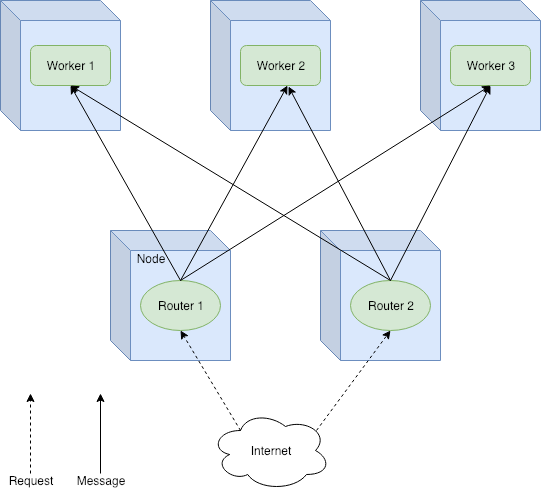
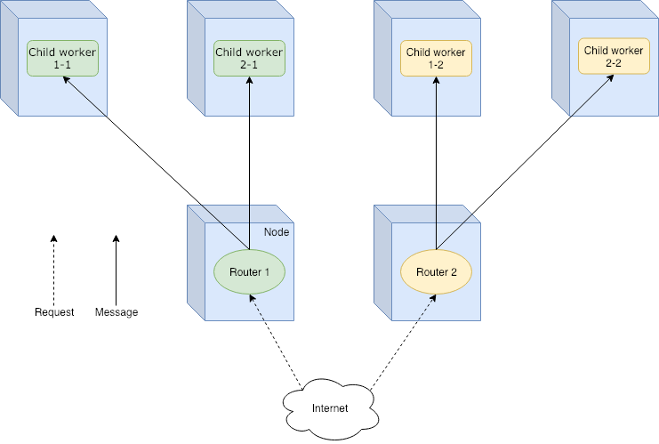
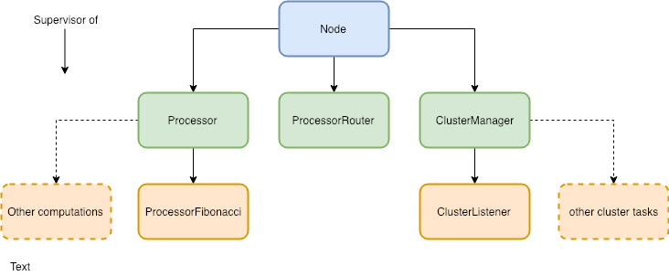

If you read my previous story about [Scalachain](https://github.com/elleFlorio/scalachain), you probably noticed that it is far from being a distributed system. It lacks all the features to properly work with other nodes. Add to it that a blockchain composed by a single node is useless. For this reason I decided it is time to work on the issue. Since Scalachain is powered by Akka, why not take the chance to play a bit with Akka Cluster? I created a [simple project](https://github.com/elleFlorio/akka-cluster-playground) to tinker a bit with [Akka Cluster](https://doc.akka.io/docs/akka/2.5/index-cluster.html), and in this story I'm going to share my learnings. We are going to create a cluster of three nodes, using [Cluster Aware Routers](https://doc.akka.io/docs/akka/2.5/cluster-routing.html#weakly-up) to balance the load among them. Everything will run in a Docker container, and we will use docker-compose for an easy deployment. Ok, Let's roll! :grin:

[](https://unsplash.com/@christianfregnan)

## Quick introduction to Akka Cluster

Akka Cluster provides a great support to the creation of distributed applications. The best use case is when you have a node that you want to replicate N times in a distributed environment. This means that all the N nodes are peers running the same code. Akka Cluster gives you out-of-the-box the discovery of members in the same cluster. Using Cluster Aware Routers it is possible to balance the messages between actors in different nodes. It is also possible to choose the balancing policy, making load-balancing a piece of cake!

Actually you can chose between two types of routers:

**Group Router** - The actors to send the messages to - called routees - are specified using their actor path. The routers share the routees created in the cluster. We will use a Group Router in this example.



**Pool Router** - The routees are created and deployed by the router, so they are its children in the actor hierarchy. Routees are not shared between routers. This is ideal for a master-slave scenario, where each router is the master and its routees the slaves.



This is just the tip of the iceberg, so I invite you to read the [official documentation](https://doc.akka.io/docs/akka/2.5/index-cluster.html) for more insights.

## A Cluster for mathematical computations

Let's picture a use-case scenario. Suppose to design a system to execute mathematical computations on request. The system is deployed online, so it needs a REST API to receive the computation requests. An internal processor handles these requests, executing the computation and returning the result. Right now the processor can only compute the [Fibonacci number](https://en.wikipedia.org/wiki/Fibonacci_number). We decide to use a cluster of nodes to distribute the load among the nodes and improve performance. Akka Cluster will handle cluster dynamics and load-balancing between nodes. Ok, sounds good!

## Actor hierarchy

First things first: we need to define our actor hierarchy. The system can be divided in three functional parts: the business logic, the cluster management, and the node itself. There is also the server but it is not an actor, and we will work on that later.

**Business logic**

The application should do mathematical computations. We can define a simple `Processor` actor to manage all the computational tasks. Every computation that we support can be implemented in a specific actor, that will be a child of the `Processor` one. In this way the application is modular and easier to extend and maintain. Right now the only child of `Processor` will be the `ProcessorFibonacci` actor. I suppose you can guess what its task is. This should be enough to start.

**Cluster management**

To manage the cluster we need a ``ClusterManager. Sounds trivial, right? This actor handles everything related to the cluster, like returning its members when asked. It would be useful to log what happens inside the cluster, so we define a `ClusterListener` actor. This is a child of the `ClusterManager`, and subscribes to cluster events logging them.

**Node**

The `Node` actor is the root of our hierarchy. It is the entry point of our system that communicates with the API. The `Processor` and the `ClusterManager` are its children, along with the `ProcessorRouter` actor. This is the load balancer of the system, distributing the load among `Processors`. We will configure it as a Cluster Aware Router, so every `ProcessorRouter` can send messages to `Processor` on every node.



## Actor Implementation

Time to implement our actors! Fist we implement the actors related to the business logic of the system. We move then on the actors for the cluster management and the root actor (`Node`) in the end.

**ProcessorFibonacci**

This actor executes the computation of the Fibonacci number. It receives a `Compute` message containing the number to compute and the reference of the actor to reply to. The reference is important, since there can be different requesting actors. Remember that we are working in a distributed environment!

Once the `Compute` message is received, the `fibonacci` function computes the result. We wrap it in a `ProcessorResponse` object to provide information on the node that executed the computation. This will be useful later to see the round-robin policy in action.

The result is then sent to the actor we should reply to. Easy-peasy.

```scala
object ProcessorFibonacci {

  sealed trait ProcessorFibonacciMessage

  case class Compute(n: Int, replyTo: ActorRef) extends ProcessorFibonacciMessage

  def props(nodeId: String) = Props(new ProcessorFibonacci(nodeId))

  def fibonacci(x: Int): BigInt = {

    @tailrec def fibHelper(x: Int, prev: BigInt = 0, next: BigInt = 1): BigInt = x match {

      case 0 => prev

      case 1 => next

      case _ => fibHelper(x - 1, next, next + prev)

    }

    fibHelper(x)

  }

}

class ProcessorFibonacci(nodeId: String) extends Actor {

  import ProcessorFibonacci._

  override def receive: Receive = {

    case Compute(value, replyTo) => {

      replyTo ! ProcessorResponse(nodeId, fibonacci(value))

    }

  }

}
```

**Processor**

The `Processor` actor manages the specific sub-processors, like the Fibonacci one. It should instantiate the sub-processors and forward the requests to them. Right now we only have one sub-processor, so  the `Processor` receives one kind of message: `ComputeFibonacci`. This message contains the Fibonacci number to compute. Once received, the number to compute is sent to a `FibonacciProcessor`, along with the reference of the `sender()`.

```scala
object Processor {

  sealed trait ProcessorMessage

  case class ComputeFibonacci(n: Int) extends ProcessorMessage

  def props(nodeId: String) = Props(new Processor(nodeId))

}

class Processor(nodeId: String) extends Actor {

  import Processor._

  val fibonacciProcessor: ActorRef = context.actorOf(ProcessorFibonacci.props(nodeId), "fibonacci")

  override def receive: Receive = {

    case ComputeFibonacci(value) => {

      val replyTo = sender()

      fibonacciProcessor ! Compute(value, replyTo)

    }

  }

}
```

**ClusterListener**

We would like to log useful information about what happens in the cluster. This could help us to debug the system if we need to. This is the purpose of the `ClusterListener` actor. Before starting, it subscribes itself to the event messages of the cluster. The actor reacts to messages like `MemberUp`, `UnreachableMember`, or `MemberRemoved`, logging the corresponding event. When `ClusterListener` is stopped, it unsubscribe itself from the cluster events.

```scala
object ClusterListener {

  def props(nodeId: String, cluster: Cluster) = Props(new ClusterListener(nodeId, cluster))

}

class ClusterListener(nodeId: String, cluster: Cluster) extends Actor with ActorLogging {

  override def preStart(): Unit = {

    cluster.subscribe(self, initialStateMode = InitialStateAsEvents,

      classOf[MemberEvent], classOf[UnreachableMember])

  }

  override def postStop(): Unit = cluster.unsubscribe(self)

  def receive = {

    case MemberUp(member) =>

      log.info("Node {} - Member is Up: {}", nodeId, member.address)

    case UnreachableMember(member) =>

      log.info(s"Node {} - Member detected as unreachable: {}", nodeId, member)

    case MemberRemoved(member, previousStatus) =>

      log.info(s"Node {} - Member is Removed: {} after {}",

        nodeId, member.address, previousStatus)

    case _: MemberEvent => // ignore

  }

}
```

**ClusterManager**

The actor responsible of the management of the cluster is `ClusterManager`. It creates the `ClusterListener` actor, and provides the list of cluster members upon request. It could be extended to add more functionalities, but right now this is enough.

```scala
object ClusterManager {

  sealed trait ClusterMessage

  case object GetMembers extends ClusterMessage

  def props(nodeId: String) = Props(new ClusterManager(nodeId))

}

class ClusterManager(nodeId: String) extends Actor with ActorLogging {

  val cluster: Cluster = Cluster(context.system)

  val listener: ActorRef = context.actorOf(ClusterListener.props(nodeId, cluster), "clusterListener")

  override def receive: Receive = {

    case GetMembers => {

      sender() ! cluster.state.members.filter(_.status == MemberStatus.up)

        .map(_.address.toString)

        .toList

    }

  }

}
```

**ProcessorRouter**

The load-balancing among processors is handled by the `ProcessorRouter`. It is created by the `Node` actor, but this time all the required information are provided in the configuration of the system. 

```scala
class Node(nodeId: String) extends Actor {

  //...

  val processorRouter: ActorRef = context.actorOf(FromConfig.props(Props.empty), "processorRouter")

  //...

}
```

Let's analyse the relevant part in the `application.conf` file.

```
akka {  
 actor {  
   ...  
   deployment {  
     /node/processorRouter {  
       router = round-robin-group  
       routees.paths = ["/user/node/processor"]  
       cluster {  
         enabled = on  
         allow-local-routees = on  
       }  
     }  
   }  
 }

...

}
```

The first thing is to specify the path to the router actor, that is 

`/node/processorRouter`. Inside that property we can configure the behaviour of the router:

*   `router`: this is the policy for the load balancing of messages. I chose the `round-robin-group`, but there are many others.
*   `routees.paths`: these are the paths to the actors that will receive the messages handled by the router. We are saying: _"When you receive a message, look for the actors corresponding to these paths. Choose one according to the policy and forward the message to it."_ Since we are using Cluster Aware Routers, the routees can be on any node of the cluster.
*   `cluster.enabled`: are we operating in a cluster? The answer is `on`, of course!
*   `cluster.allow-local-routees`: here we are allowing the router to choose a routee in its node.

Using this configuration we can create a router to load balance the work among our processors.

**Node**

The root of our actor hierarchy is the `Node`. It creates the children actors - `ClusterManager`, `Processor`, and `ProcessorRouter` - and forwards the messages to the right one. Nothing complex here.

```scala
object Node {

  sealed trait NodeMessage

  case class GetFibonacci(n: Int)

  case object GetClusterMembers

  def props(nodeId: String) = Props(new Node(nodeId))

}

class Node(nodeId: String) extends Actor {

  val processor: ActorRef = context.actorOf(Processor.props(nodeId), "processor")

  val processorRouter: ActorRef = context.actorOf(FromConfig.props(Props.empty), "processorRouter")

  val clusterManager: ActorRef = context.actorOf(ClusterManager.props(nodeId), "clusterManager")

  override def receive: Receive = {

    case GetClusterMembers => clusterManager forward GetMembers

    case GetFibonacci(value) => processorRouter forward ComputeFibonacci(value)

  }

}
```

## Server and API

Every node of our cluster runs a server able to receive requests. The  `Server` creates our actor system and is configured through the `application.conf` file. 

```scala
object Server extends App with NodeRoutes {

  implicit val system: ActorSystem = ActorSystem("cluster-playground")

  implicit val materializer: ActorMaterializer = ActorMaterializer()

  val config: Config = ConfigFactory.load()

  val address = config.getString("http.ip")

  val port = config.getInt("http.port")

  val nodeId = config.getString("clustering.ip")

  val node: ActorRef = system.actorOf(Node.props(nodeId), "node")

  lazy val routes: Route = healthRoute ~ statusRoutes ~ processRoutes

  Http().bindAndHandle(routes, address, port)

  println(s"Node $nodeId is listening at http://$address:$port")

  Await.result(system.whenTerminated, Duration.Inf)

}
```

[Akka HTTP](https://doc.akka.io/docs/akka-http/current/index.html) powers the server itself and the REST API, exposing three simple endpoints. These endpoints are defined in the `NodeRoutes` trait. 

The first one is `/health`, to check the health of a node. It responds with a `200 OK` if the node is up and running

```scala
lazy val healthRoute: Route = pathPrefix("health") {

    concat(

      pathEnd {

        concat(

          get {

            complete(StatusCodes.OK)

          }

        )

      }

    )

  }
```

The `/status/members` endpoint responds with the current active members of the cluster.

```scala
lazy val statusRoutes: Route = pathPrefix("status") {

    concat(

      pathPrefix("members") {

        concat(

          pathEnd {

            concat(

              get {

                val membersFuture: Future[List[String]] = (node ? GetClusterMembers).mapTo[List[String]]

                onSuccess(membersFuture) { members =>

                  complete(StatusCodes.OK, members)

                }

              }

            )

          }

        )

      }

    )

  }
```

The last (but not the least) is the `/process/fibonacci/n` endpoint, used to request the Fibonacci number of `n`.  

```scala
lazy val processRoutes: Route = pathPrefix("process") {

    concat(

      pathPrefix("fibonacci") {

        concat(

          path(IntNumber) { n =>

            pathEnd {

              concat(

                get {

                  val processFuture: Future[ProcessorResponse] = (node ? GetFibonacci(n)).mapTo[ProcessorResponse]

                  onSuccess(processFuture) { response =>

                    complete(StatusCodes.OK, response)

                  }

                }

              )

            }

          }

        )

      }

    )

  }
```

It responds with a `ProcessorResponse` containing the result, along with the id of the node where the computation took place.

## Cluster Configuration

Once we have all our actors, we need to configure the system to run as a cluster! The `application.conf` file is where the magic takes place. I'm going to split it in pieces to present it better, but you can find the complete file [here](https://github.com/elleFlorio/akka-cluster-playground/blob/master/src/main/resources/application.conf).

Let's start defining some useful variables.

```
clustering {  
 ip = "127.0.0.1"  
 ip = **$**{?CLUSTER_IP}  

 port = 2552  
 port = **$**{?CLUSTER_PORT}  

 seed-ip = "127.0.0.1"  
 seed-ip = **$**{?CLUSTER_SEED_IP}  

 seed-port = 2552  
 seed-port = **$**{?CLUSTER_SEED_PORT}  

 cluster.name = "cluster-playground"  
}
```

Here we are simply defining the ip and port of the nodes and the seed, as well as the cluster name. We set a default value, then we override it if a new one is specified. The configuration of the cluster is the following.

```
akka {

  actor {

    provider = "cluster"

    ...

    /* router configuration */

    ...

  }

  remote {

    log-remote-lifecycle-events = on

    netty.tcp {

      hostname = ${clustering.ip}

      port = ${clustering.port}

    }

  }

  cluster {

    seed-nodes = [

      "akka.tcp://"${clustering.cluster.name}"@"${clustering.seed-ip}":"${clustering.seed-port}

    ]

    auto-down-unreachable-after = 10s

  }

}
```

Akka Cluster is build on top of Akka Remoting, so we need to configure it properly. First of all, we specify that we are going to use Akka Cluster saying that `provider = "cluster"`. Then we bind `clustering.ip` and `clustering.port` to the `hostname` and `port` of the `netty` web framework. The cluster requires some seed nodes as its entry points. We set them in the `seed-nodes` array, in the format  `akka.tcp://"${clustering.cluster.name}"@"${clustering.seed-ip}":"${clustering.seed-port}`. Right now we have one seed node, but we may add more later. The `auto-down-unreachable-after` property sets a member as down after it is unreachable for a period of time. This should be used only during development, as explained in the [official documentation](https://doc.akka.io/docs/akka/2.5/cluster-usage.html#auto-downing-do-not-use-). Ok, the cluster is configured, we can move to the next step: Dockerization and deployment!

## Dockerization and deployment

To create the Docker container of our node, we can use [sbt-native-packager](https://www.scala-sbt.org/sbt-native-packager). Its installation is easy: add `addSbtPlugin("com.typesafe.sbt" % "sbt-native-packager" % "1.3.15")` to the `plugin.sbt` file in the `project/` folder. This amazing tool has a plugin for the creation of Docker containers. it allows us to configure the properties of our Dockerfile in the `build.sbt` file.

```
/* other build.sbt properties */

...

enablePlugins(JavaAppPackaging)

enablePlugins(DockerPlugin)

enablePlugins(AshScriptPlugin)

mainClass in Compile := Some("com.elleflorio.cluster.playground.Server")

dockerBaseImage := "java:8-jre-alpine"

version in Docker := "latest"

dockerExposedPorts := Seq(8000)

dockerRepository := Some("elleflorio")
```

Once we have setup the plugin, we can create the docker image running the command `sbt docker:publishLocal`. Run the command and taste the magic... :grin:

We have the Docker image of our node, now we need to deploy it and check everything works fine. The easiest way is to create a `docker-compose` file that will spawn a seed and a couple of other nodes. 

```
version: '3.5'

networks:

  cluster-network:

services:

  seed:

    networks:

      - cluster-network

    image: elleflorio/akka-cluster-playground

    ports:

      - '2552:2552'

      - '8000:8000'

    environment:

      SERVER_IP: 0.0.0.0

      CLUSTER_IP: seed

      CLUSTER_SEED_IP: seed

  node1:

    networks:

      - cluster-network

    image: elleflorio/akka-cluster-playground

    ports:

      - '8001:8000'

    environment:

      SERVER_IP: 0.0.0.0

      CLUSTER_IP: node1

      CLUSTER_PORT: 1600

      CLUSTER_SEED_IP: seed

      CLUSTER_SEED_PORT: 2552

  node2:

    networks:

      - cluster-network

    image: elleflorio/akka-cluster-playground

    ports:

      - '8002:8000'

    environment:

      SERVER_IP: 0.0.0.0

      CLUSTER_IP: node2

      CLUSTER_PORT: 1600

      CLUSTER_SEED_IP: seed

      CLUSTER_SEED_PORT: 2552

```
I won't spend time going through it, since it is quite trivial. 

## Let's run it!

Time to test our work! Once we run the `docker-compose up` command, we will have a cluster of three nodes up and running. The `seed` will respond to requests at port `:8000`, while `node1` and `node2` at port `:8001` and `:8002`. Play a bit with the various endpoints. You will see that the requests for a Fibonacci number will be computed by a different node each time, following a round-robin policy. That's good, we are proud of our work and can get out for a beer to celebrate! :beer:

## Conclusion

Guys, we are done here! We learned a lot of things in these ten minutes:

*   What Akka Cluster is and what can do for us.
*   How to create a distributed application with it.
*   How to configure a Group Router for load-balancing in the cluster.
*   How to Dockerize everything and deploy it using docker-compose.

You can find the complete application in my [GitHub repo](https://github.com/elleFlorio/akka-cluster-playground). Feel free to contribute or play with it as you like! :wink:

See you! 🚀