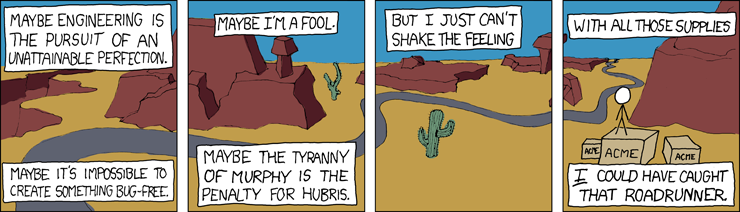

The work of a Software Engineer is to solve problems. Everything can be reduced to this activity. This is why it is important to have a solid methodology to tackle problems. We are engineers after all, and we are trained to solve problems. We have to do it like an engineer.

## Understand the requirements

The first step is to **understand the requirements**. To solve a problem, you have to understand exactly what the problem is. It happened to me that a feature that would have been a 2/3 weeks work, became 3 useless months of “*Oh, there is also that…*”, “*Oh, we didn’t think about that!*”, and “*Maybe it would be better if….*”. My fault. Lesson learned. 
When you start solving a problem, be sure to understand the **starting point**, the **end goal**, and the **obstacles in between**. The worst possible thing is to produce a solution that actually doesn’t do what’s expected. 
As a final note, remember that *you* and only *you* decide *how* to solve the problem. It is your job, as it is the job of who gives you the requirements of the new feature to express them the best possible way. If someone that is not an engineer tries to tell you how to solve the problem, punch him in the face. You are perfectly justified. At least by me.

## Understand the size

we all agree that serving 100000 requests per second is a bit different from serving 100 requests per minute. The approach to solving the problem is different. This is why it is important to understand what is the *“size of the input”* or, put another way, **how big the problem is**. Otherwise, there are two scenarios. The best case is that you spend 6 months designing and implementing a system that is used at 10%. The worst case is when you spend 1 month designing a system that is used at 180%. If the best case is a waste of time/resources, you don’t want to find yourself in the worst case. To avoid this situation, we have to ask the right questions.
- *How many requests the system should satisfy?*
- *What is the expected response time?*
- *How many resources do we have?*
- *What about deadlines?*
The right questions depend on the context, but the target is one and only one: **understand the size of the problem**.

## Stand on the shoulders of giants…

I’ll tell you a secret. The chance someone else already solved your problem is high. **Very high**. All you have to do is a search in the literature to find out if there is a solution for a problem matching your use case. Avoid home-made solution to well-known problems, they only bring other problems. There are lots of companies having “their Hibernate”, “their Kafka”, etc. because:
- *“We have a different use case”* (I want to see it)
- *“The performance of technology X is not enough for us”* (really?)
- *“We can do it better”* (this is the funniest)
Bottom line: once you know your requirements and the size of the problem, do a search in the literature. **There is no point in reinventing the wheel**.

## …But remember you are not a giant

It’s ok to build-up on existing solutions, but avoid overshooting. Remember that [you are not Google](https://blog.bradfieldcs.com/you-are-not-google-84912cf44afb). In the ocean of cool technologies out there, the most famous/innovative/used not always is the best one for you. Deploy a Kafka cluster to process 5 messages a day probably is not a good idea. Choose the technology that **will do the job with the minimum complexity**. This decision will pay you in the long run.

## Grandma-Driven Development

Implement your solution trying to make it understandable by your grandma. Avoid fancy and super complex implementations. Put them aside in favour of a *simple* and *understandable* one. This will make the code more maintainable. Leave optimization to the moment they are necessary.
More formally, your implementation should follow the [Rule of Least Power](https://en.wikipedia.org/wiki/Rule_of_least_power). The original rule refers to the choice of the programming language. In this context, we can read it as:
> “Among the available solutions, choose the least powerful one that can solve your problem.”

I learned this rule when I started using functional programming. It allows you to implement solutions with an unpaired elegance. However, such solutions sometimes are too much complex. I prefer an implementation a little less elegant and efficient, but a lot more understandable and maintainable. **You will not be the only one reading your code**.

## Conclusion

We are engineers, our work is to solve problems, in whatever form they appear. We need to apply our engineering skills and analyze the problem *pragmatically* to deliver the correct solution. We need to remember that it is not the solution for producing the desired result. It is the one that does it requiring **the least effort**, and with the **least complexity**. I hope the methodology I described in this story will help you make a step toward such an achievement.

See you! 🚀