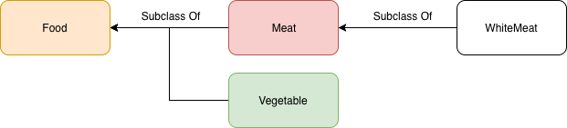
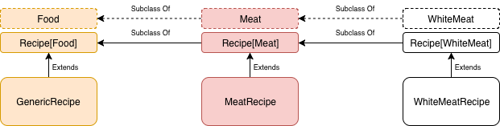
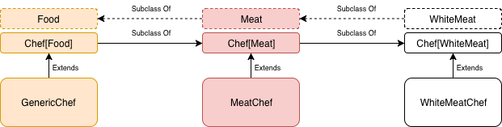

I understand that type variance is not fundamental to writing Scala code. It's been more or less a year since I've been using Scala for my day-to-day job, and honestly, I've never had to worry much about it. 

[](https://unsplash.com/@danielcgold?utm_source=unsplash&utm_medium=referral&utm_content=creditCopyText)

However, I think it is an interesting "advanced" topic, so I started to study it. It is not easy to grasp it immediately, but with the right example, it might be a little bit easier to understand. Let me try using a food-based analogy...

## What is type variance?
First of all, we have to define what type variance is. When you develop in an Object-Oriented language, you can define complex types. That means that a type may be parametrized using another type (component type). 

Think of `List` for example. You cannot define a `List` without specifying which types will be inside the list. You do it by putting the type contained in the list inside square brackets: `List[String]`. When you define a complex type, you can specify how it will vary its subtype relationship according to the relation between the component type and its subtypes. 

Ok, sounds like a mess... Let's get a little practical. 

## Building a restaurant empire
Our goal is to build an empire of restaurants. We want generic and specialised restaurants. Every restaurant we will open needs a menu composed of different recipes, and a (possibly) starred chef. 

The recipes can be composed of different kinds of food (fish, meat, white meat, vegetables, etc.), while the chef we hire has to be able to cook that kind of food. This is our model. Now it's coding time!

## Different types of food
For our food-based example, we start by defining the `Trait Food`, providing just the name of the food. 

```scala
trait Food {

  def name: String

}
```

Then we can create `Meat` and `Vegetable`, that are subclasses of `Food`. 

```scala
class Meat(val name: String) extends Food
```
```scala
class Vegetable(val name: String) extends Food
```

In the end, we define a `WhiteMeat` class that is a subclass of `Meat`. 

```scala
class WhiteMeat(override val name: String) extends Meat(name)
```

Sounds reasonable right? So we have this hierarchy of types.



We can create some food instances of various type. They will be the ingredients of the recipes we are going to serve in our restaurants.

```scala
// Food <- Meat
val beef = new Meat("beef")

// Food <- Meat <- WhiteMeat
val chicken = new WhiteMeat("chicken")
val turkey = new WhiteMeat("turkey")

// Food <- Vegetable
val carrot = new Vegetable("carrot")
val pumpkin = new Vegetable("pumpkin")
```

## Recipe, a covariant type
Let's define the covariant type `Recipe`. It takes a component type that expresses the base food for the recipe - that is, a recipe based on meat, vegetable, etc.

```scala
trait Recipe[+A] {

  def name: String

  def ingredients: List[A]

}
```

The `Recipe` has a name and a list of ingredients. The list of ingredients has the same type of `Recipe`. To express that the `Recipe` is covariant in its type `A`, we write it as `Recipe[+A]`. The generic recipe is based on every kind of food, the meat recipe is based on meat, and a white meat recipe has just white meat in its list of ingredients.

```scala
case class GenericRecipe(ingredients: List[Food]) extends Recipe[Food] {

  def name: String = s"Generic recipe based on ${ingredients.map(_.name)}"

}
```
```scala
case class MeatRecipe(ingredients: List[Meat]) extends Recipe[Meat] {

  def name: String = s"Meat recipe based on ${ingredients.map(_.name)}"

}
```
```scala
case class WhiteMeatRecipe(ingredients: List[WhiteMeat]) extends Recipe[WhiteMeat] {

  def name: String = s"Meat recipe based on ${ingredients.map(_.name)}"

}
```

A type is covariant if it follows the same relationship of subtypes of its component type. This means that `Recipe` follows the same subtype relationship of its component Food.



Let's define some recipes that will be part of different menus.

```scala
// Recipe[Food]: Based on Meat or Vegetable
val mixRecipe = new GenericRecipe(List(chicken, carrot, beef, pumpkin))
// Recipe[Food] <- Recipe[Meat]: Based on any kind of Meat
val meatRecipe = new MeatRecipe(List(beef, turkey))
// Recipe[Food] <- Recipe[Meat] <- Recipe[WhiteMeat]: Based only on WhiteMeat
val whiteMeatRecipe = new WhiteMeatRecipe(List(chicken, turkey))
```

## Chef, a contravariant type
We defined some recipes, but we need a chef to cook them. This gives us the chance to talk about contravariance. A type is contravariant if it follows an inverse relationship of subtypes of its component type. Let's define our complex type `Chef`, that is contravariant in the component type. The component type will be the food that the chef can cook. 

```scala
trait Chef[-A] {
  
  def specialization: String

  def cook(recipe: Recipe[A]): String
}
```

A `Chef` has a specialisation and a method to cook a recipe based on a specific food. We express that it is contravariant writing it as `Chef[-A]`. Now we can create a chef able to cook generic food, a chef able to cook meat and a chef specialised on white meat.

```scala
class GenericChef extends Chef[Food] {

  val specialization = "All food"

  override def cook(recipe: Recipe[Food]): String = s"I made a ${recipe.name}"
}
```
```scala
class MeatChef extends Chef[Meat] {

  val specialization = "Meat"

  override def cook(recipe: Recipe[Meat]): String = s"I made a ${recipe.name}"
}
```
```scala
class WhiteMeatChef extends Chef[WhiteMeat] {

  override val specialization = "White meat"

  def cook(recipe: Recipe[WhiteMeat]): String = s"I made a ${recipe.name}"
}
```

Since `Chef` is contravariant, `Chef[Food]` is a subclass of `Chef[Meat]` that is a subclass of `Chef[WhiteMeat]`. This means that the relationship between subtypes is the inverse of its component type Food.



Ok, we can now define different chef with various specialization to hire in our restaurants.

```scala
// Chef[WhiteMeat]: Can cook only WhiteMeat
val giuseppe = new WhiteMeatChef
giuseppe.cook(whiteMeatRecipe)

// Chef[WhiteMeat] <- Chef[Meat]: Can cook only Meat
val alfredo = new MeatChef
alfredo.cook(meatRecipe)
alfredo.cook(whiteMeatRecipe)

// Chef[WhiteMeat]<- Chef[Meat] <- Chef[Food]: Can cook any Food
val mario = new GenericChef
mario.cook(mixRecipe)
mario.cook(meatRecipe)
mario.cook(whiteMeatRecipe)
```

## Restaurant, where things come together
We have recipes, we have chefs, now we need a restaurant where the chef can cook a menu of recipes.

```scala
trait Restaurant[A] {

  def menu: List[Recipe[A]]
  def chef: Chef[A]

  def cookMenu: List[String] = menu.map(chef.cook)
}
```

We are not interested in the subtype relationship between restaurants, so we can define it as invariant. An invariant type does not follow the relationship between the subtypes of the component type. In other words, `Restaurant[Food]` is not a subclass or superclass of `Restaurant[Meat]`. They are simply unrelated.
We will have a `GenericRestaurant`, where you can eat different type of food. The `MeatRestaurant` is specialised in meat-based dished and the `WhiteMeatRestaurant` is specialised only in dishes based on white meat. Every restaurant to be instantiated needs a menu, that is a list of recipes, and a chef able to cook the recipes in the menu. Here is where the subtype relationship of `Recipe` and `Chef` comes into play.

```scala
case class GenericRestaurant(menu: List[Recipe[Food]], chef: Chef[Food]) extends Restaurant[Food]
```
```scala
case class MeatRestaurant(menu: List[Recipe[Meat]], chef: Chef[Meat]) extends Restaurant[Meat]
```
```scala
case class WhiteMeatRestaurant(menu: List[Recipe[WhiteMeat]], chef: Chef[WhiteMeat]) extends Restaurant[WhiteMeat]
```

Let's start defining some generic restaurants. In a generic restaurant, the menu is composed of recipes of various type of food. Since `Recipe` is covariant, a `GenericRecipe` is a superclass of `MeatRecipe` and `WhiteMeatRecipe`, so I can pass them to my `GenericRestaurant` instance. The thing is different for the chef. If the Restaurant requires a chef that can cook generic food, I cannot put in it a chef able to cook only a specific one. The class `Chef` is covariant, so `GenericChef` is a subclass of `MeatChef` that is a subclass of `WhiteMeatChef`. This implies that I cannot pass to my instance anything different from `GenericChef`.

```scala
val allFood = new GenericRestaurant(List(mixRecipe), mario)
val foodParadise = new GenericRestaurant(List(meatRecipe), mario)
val superFood = new GenericRestaurant(List(whiteMeatRecipe), mario)
```

The same goes for `MeatRestaurant` and `WhiteMeatRestaurant`. I can pass to the instance only a menu composed of more specific recipes then the required one, but chefs that can cook food more generic than the required one.

```scala
val meat4All = new MeatRestaurant(List(meatRecipe), alfredo)
val meetMyMeat = new MeatRestaurant(List(whiteMeatRecipe), mario)
```
```scala
val notOnlyChicken = new WhiteMeatRestaurant(List(whiteMeatRecipe), giuseppe)
val whiteIsGood = new WhiteMeatRestaurant(List(whiteMeatRecipe), alfredo)
val wingsLovers = new WhiteMeatRestaurant(List(whiteMeatRecipe), mario)
```

That's it, our empire of restaurants is ready to make tons of money!

## Conclusion
Ok guys, in this story I did my best to explain type variances in Scala. It is an advanced topic, but it is worth to know just out of curiosity. I hope that the restaurant example can be of help to make it more understandable. If something is not clear, or if I wrote something wrong (I'm still learning!) don't hesitate to leave a comment!

See you! 🚀