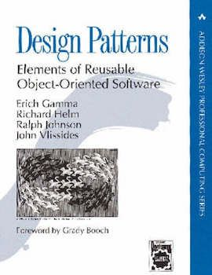
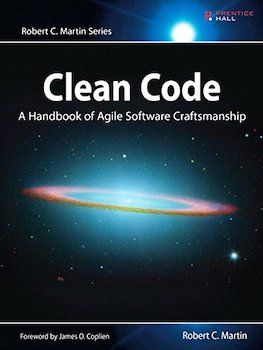
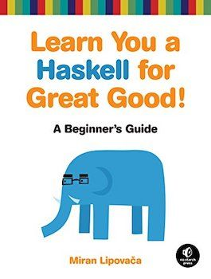
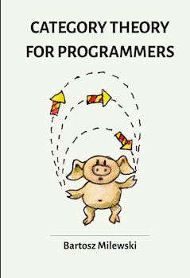
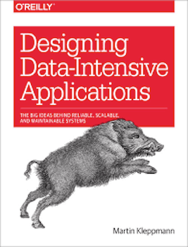
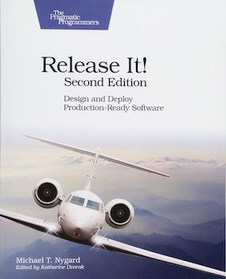
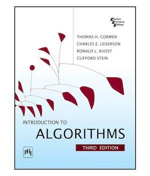
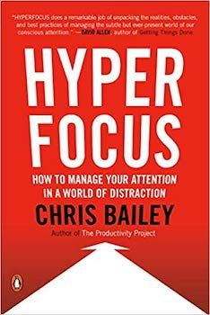
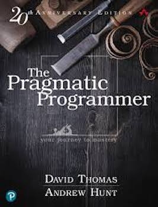
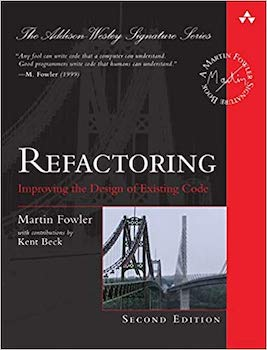

Keeping up to date and constantly improving is part of the job of a software engineer.

There are lots of ways to study new things on the internet like MOOCs, tutorials, and articles. However, **sometimes a physical book is the best choice**, especially when it is a "reference" that provides knowledge that will last for the years to come. We can put it on our bookshelf and go through it every time we feel it is necessary.

This is a list of reference books I keep on my software engineering bookshelf. I hope it can be a source of inspiration for everyone looking for something interesting to read! 😉 

## What I have on my bookshelf

### Design Patterns: Elements of Reusable Object-Oriented Software

This is a classic. 

In this book, the so-called "Gang of Four" present the **23 design patterns** that drove the Object-Oriented world for decades. New patterns have been created since then, but the ones in the book are considered the foundations of all other patterns.

It is not an easy read, but you should have a look at it just to understand where to find what you need on every occasion. Keep it on your desk, and go through it when you are building something and have the feeling, "What I'm doing sounds familiar." You will probably discover that you are trying to implement a design pattern already described in this book.

### Clean Code: A Handbook of Agile Software Craftsmanship

I read this book many years ago, but it has stuck with me since then. 

This is a great source of best practices to produce clean, readable code and avoid code smells. The book is focused mainly on Java/OOP, but lots of advice can be applied to every language or programming paradigm. 

Writing maintainable and readable code is not a luxury -- it is something **every good software engineer should aspire to**. This book will provide you with the knowledge to make that happen. 

Uncle Bob can be a little extreme sometimes, and I don't agree with him on all of the presented techniques. My suggestion: read it, and take with you only the things you feel are right. In any case, **it is a book worth reading**.

### Learn You a Haskell for Great Good!: A Beginner's Guide

This is a book on the Haskell programming language, so why buy it and keep it as a reference? My reasons are:
* It is a very well written and easy-to-read book on a not-so-easy topic like functional programming
* It gives you the foundation of functional thinking, not just Haskell syntax
* Haskell is a very elegant language and I like it

This is the book that introduced me to functional programming. Right now I program mainly in Scala, but the transition has been a lot easier after learning the basics of Haskell. 

Functional programming is not easy, but it will open your mind. It can be very theoretical, and **put it into practice using Haskell will help a lot**. 

There are also very nice drawings in the book, so you have no excuse not to flip through it. 😁

### Category Theory for Programmers

This book covers **Category theory**, which is the foundation of the functional programming paradigm.

The topic is quite complex for non-mathematicians, but the author has put great effort into making it understandable for developers. I admit that I had some difficulties reading it, but I would like to go through it again.

This book is not required to become a great functional programmer. Read it if you like challenges and want to go deeper on the theoretical foundations of functional programming.

### Designing Data-Intensive Applications: The Big Ideas Behind Reliable, Scalable, and Maintainable Systems

This is my favourite, maybe because I love distributed systems! :-D

In this book, Martin Kleppmann describes all the various aspects of distributed systems, from serialisation to consistency models and consensus, passing through the various database engines. He also explores new trendings regarding data-driven applications.

In a world of cloud-native microservices-based applications, it is fundamental to know the various aspects of a distributed system. The knowledge provided by this book is not tied to a specific technology and **will be valuable your entire career in software engineering**.

### Release It!: Design and Deploy Production-Ready Software

I'm reading this one now. 

Are we finished once our software is sent to production? Nope, **that is just the beginning!** 

This book highlights what can go wrong after the software is put in production and has to face real users. It describes anti-patterns that can undermine the stability of our software, as well as solutions to such problems. 

What I like the most about this book is that every chapter starts with an example taken from real life. Then the author analyses the problems that caused the software to fail in production. I think learning from concrete examples is a very effective approach.

### Introduction to Algorithms

What can I say about this book? **Just buy it and keep it on your desk**.

If you are a software engineer, there is a high chance you had to study data structures and algorithms. It is not always easy to deal with complexity or to choose the right data structure. 

When doubts arise, open this book and you will find what you need for. 

For most people (including me) this is a very hard read. I usually just read what I need to know at that moment, and keep the book in sight on my desk.

### Hyperfocus: How to Manage Your Attention in a World of Distraction

This is not a technical book, but it is in the set of readings that changed my life in better. 

Our work as software engineers consists of solving problems with our minds. To be effective in this task, **we need the ability to completely focus on the problem we are solving**. 

Here you can find lots of suggestions and techniques to maximise the time you can focus on a task. The author discusses also the importance of letting your mind wander when you need to be more creative. 

Mastering how to use your attention is something that will improve not only your performance at work, but also every other aspect of your life.

## What I will add to my bookshelf

### The Pragmatic Programmer

This is one of the most famous books in software development. 

The suggestions and techniques presented in this book influenced the careers of many developers and engineers for the better. The book was been published in 1999, but it is now available as new and updated 20th-anniversary edition. 

You can't miss this. 😄

### Refactoring: Improving the Design of Existing Code

It is hard to always deliver high-quality code. Deadlines, urgency, a bad day all affect the quality of your work. 

That's why refactoring is so important. If we couldn't provide quality the first time, we can improve it later for better maintainability. Martin Fowler (one of my idols in the world of software development) describes the best techniques for an effective refactoring. 

There will be always space on my bookshelf for books that help me write better code.

## Conclusion

This is my list of must-have books on software engineering. It is by no means a comprehensive list of "important" books in this field, and I'm sure I will add more and more books in the years to come. 

Hopefully I gave you some nice tips on the next book you should read. 😄 

See you! 🚀