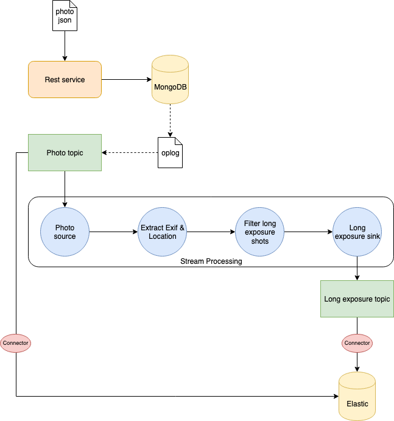
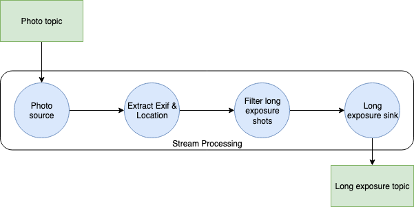

**Change Data Capture** (CDC) involves observing the changes happening in a database and making them available in a form that can be exploited by other systems. 

One of the most interesting use-cases is to make them available as a stream of events. This means you can, for example, catch the events and update a search index as the data are written to the database.

Interesting right? Let's see how to implement a CDC system that can observe the changes made to a NoSQL database (**MongoDB**), stream them through a message broker (**Kafka**), process the messages of the stream (**Kafka Streams**), and update a search index (**Elasticsearch**)!🚀

[](https://unsplash.com/@jontyson?utm_source=unsplash&utm_medium=referral&utm_content=creditCopyText)

### TL;DR
The full code of the project is available on GitHub in this [repository](https://github.com/elleFlorio/kafka-streams-playground). If you want to skip all my jibber jabber and just run the example, go straight to the 
**How to run the project** section near the end of the article!😁

## Use case & infrastructure
We run a web application that stores photos uploaded by users. People can share their shots, let others download them, create albums, and so on. Users can also provide a description of their photos, as well as Exif metadata and other useful information. 

We want to store such information and use it to improve our search engine. We will focus on this part of our system that is depicted in the following diagram.



The information is provided in `JSON` format. Since I like to post my shots on [Unsplash](https://unsplash.com/), and the website provides free access to its API, I used their model for the photo `JSON` document.

Once the `JSON` is sent through a `POST` request to our server, we store the document inside a **MongoDB** database. We will also store it in **Elasticsearch** for indexing and quick search. 

However, we love **long exposure shots**, and we would like to store in a separate index a subset of information regarding this kind of photo. It can be the exposure time, as well as the location (latitude and longitude) where the photo has been taken. In this way, we can create a map of locations where photographers usually take long exposure photos.

Here comes the interesting part: instead of explicitly calling Elasticsearch in our code once the photo info is stored in MongoDB, we can implement a **CDC** exploiting Kafka and **Kafka Streams**. 

We listen to modifications to MongoDB **oplog** using the interface provided by MongoDB itself. When the photo is stored we send it to a `photo` Kafka topic. Using **Kafka Connect**, an Elasticsearch sink is configured to save everything sent to that topic to a specific index. In this way, we can index all photos stored in MongoDB automatically.

We need to take care of the long exposure photos too. It requires some processing of the information to extract what we need. For this reason, we use Kafka Streams to create a **processing topology** to:

1. Read from the `photo` topic
2. Extract Exif and location information
3. Filter long exposure photos (exposure time > 1 sec.)
4. Write to a `long-exposure` topic.

Then another Elasticsearch sink will read data from the `long-exposure` topic and write it to a specific index in Elasticsearch.

It is quite simple, but it's enough to have fun with CDC and Kafka Streams! 😁

## Server implementation
Let's have a look at what we need to implement: our server exposing the **REST API**s!

### Models and DAO
First things first, we need a model of our data and a **Data Access Object** (DAO) to talk to our MongoDB database. 

As I said, the model for the photo `JSON` information is the one used by Unsplash. Check out the free API [documentation](https://unsplash.com/documentation#get-a-photo) for an example of the `JSON` we will use. 

I created the mapping for the serializaion/deserialization of the photo `JSON` using [spray-json](https://github.com/spray/spray-json). I'll skip the details about this, if you are curious just look at the [repo](https://github.com/elleFlorio/kafka-streams-playground/tree/master/src/main/scala/com/elleflorio/kafka/streams/playground/dao/model/unsplash)!

Let's focus on the model for the long exposusure photo.
```scala
case class LongExposurePhoto(id: String, exposureTime: Float, createdAt: Date, location: Location)

object LongExposurePhotoJsonProtocol extends DefaultJsonProtocol {
  implicit val longExposurePhotoFormat:RootJsonFormat[LongExposurePhoto] = jsonFormat(LongExposurePhoto, "id", "exposure_time", "created_at", "location")
}
```
This is quite simple: we keep from the photo `JSON` the information about the `id`, the exposure time (`exposureTime`), when the photo has been created (`createdAt`), and the `location` where it has been taken. The `location` comprehends the `city`, the `country`, and the `position` composed of `latitude` and `longitude`.

The DAO consists of just the `PhotoDao.scala` class. 
```scala
class PhotoDao(database: MongoDatabase, photoCollection: String) {

  val collection: MongoCollection[Document] = database.getCollection(photoCollection)

  def createPhoto(photo: Photo): Future[String] = {
    val doc = Document(photo.toJson.toString())
    doc.put("_id", photo.id)
    collection.insertOne(doc).toFuture()
      .map(_ => photo.id)
  }
}
```
Since I want to keep this example minimal and focused on the CDC implementation, the DAO has just one method to create a new photo document in MongoDB. 

It is straightforward: create a document from the photo `JSON`, and insert it in mongo using `id` as the one of the photo itself. Then, we can return the `id` of the photo just inserted in a `Future` (the MongoDB API is async).

### Kafka Producer
Once the photo is stored inside MongoDB, we have to send it to the `photo` Kafka topic. This means we need a producer to write the message in its topic. The `PhotoProducer.scala` class looks like this.
```scala
case class PhotoProducer(props: Properties, topic: String) {

  createKafkaTopic(props, topic)
  val photoProducer = new KafkaProducer[String, String](props)

  def sendPhoto(photo: Photo): Future[RecordMetadata] = {
    val record = new ProducerRecord[String, String](topic, photo.id, photo.toJson.compactPrint)
    photoProducer.send(record)
  }

  def closePhotoProducer(): Unit = photoProducer.close()
}
```
I would say that this is pretty self-explanatory. The most interesting part is probably the `createKafkaTopic` method that is implemented in the `utils` package.
```scala
def createKafkaTopic(props: Properties, topic: String): Unit = {
    val adminClient = AdminClient.create(props)
    val photoTopic = new NewTopic(topic, 1, 1)
    adminClient.createTopics(List(photoTopic).asJava)
  }
```
This method creates the topic in Kafka setting 1 as a partition and replication factor (it is enough for this example). It is not required, but creating the topic in advance lets Kafka balance partitions, select leaders, and so on. This will be useful to get our stream topology ready to process as we start our server.

### Event Listener
We have the DAO that writes in MongoDB and the producer that sends the message in Kafka. We need to glue them together in some way so that when the document is stored in MongoDB the message is sent to the `photo` topic. This is the purpose of the `PhotoListener.scala` class.
```scala
case class PhotoListener(collection: MongoCollection[Document], producer: PhotoProducer) {

  val cursor: ChangeStreamObservable[Document] = collection.watch()

  cursor.subscribe(new Observer[ChangeStreamDocument[Document]] {
    override def onNext(result: ChangeStreamDocument[Document]): Unit = {
      result.getOperationType match {
        case OperationType.INSERT => {
          val photo = result.getFullDocument.toJson().parseJson.convertTo[Photo]
          producer.sendPhoto(photo).get()
          println(s"Sent photo with Id ${photo.id}")
        }
        case _ => println(s"Operation ${result.getOperationType} not supported")
      }
    }
    override def onError(e: Throwable): Unit = println(s"onError: $e")
    override def onComplete(): Unit = println("onComplete")})
}
```
We exploit the [Chage Streams interface](https://docs.mongodb.com/manual/changeStreams/) provided by the MongoDB scala library. 

Here is how it works: we `watch()` the collection where photos are stored. When there is a new event (`onNext`) we run our logic. 

For this example we are interested only in the creation of new documents, so we explicitly check that the operation is of type `OperationType.INSERT`. If the operation is the one we are interested in, we get the document and convert it to a `Photo` object to be sent by our producer. 

That's it! With few lines of code we connected the creation of documents in MongoDB to a stream of events in Kafka.🎉

As a side note, be aware that to use the Change Streams interface **we have to setup a MongoDB replica set**. This means we need to run 3 instances of MongoDB and configure them to act as a replica set using the following command in mongo client:
```shell
rs.initiate({_id : "r0", members: [{ _id : 0, host : "mongo1:27017", priority : 1 },{ _id : 1, host :"mongo2:27017", priority : 0 },{ _id : 2, host : "mongo3:27017", priority : 0, arbiterOnly: true }]})
```
Here our instances are the containers we will run in the docker-compose file, that is `mongo1`, `mongo2`, and `mongo3`.

### Processing Topology
Time to build our processing topology! It will be in charge of the creation of the `long-exposure` index in Elasticsearch. The topology is described by the following diagram:



and it is implemented in the `LongExposureTopology.scala` object class.
Let's analyse every step of our processing topology.
```scala
val stringSerde = new StringSerde

val streamsBuilder = new StreamsBuilder()

val photoSource: KStream[String, String] = streamsBuilder.stream(sourceTopic, Consumed.`with`(stringSerde, stringSerde))
```
The first step is to read from a source topic. We start a stream from the `sourceTopic` (that is `photo` topic) using the `StreamsBuilder()` object. The `stringSerde` object is used to serialise and deserialise the content of the topic as a `String`. 

Please notice that at each step of the processing we create a new stream of data with a `KStream` object. When creating the stream, we specify the key and the value produced by the stream. In our topology the key will always be a `String`. In this step the value produced is still a `String`.

```scala
val covertToPhotoObject: KStream[String, Photo] =
      photoSource.mapValues((_, jsonString) => {
        val photo = jsonString.parseJson.convertTo[Photo]
        println(s"Processing photo ${photo.id}")
        photo
      })
```
The next step is to convert the value extracted from the `photo` topic into a proper `Photo` object. 

So we start from the `photoSource` stream and work on the values using the `mapValues` function. We simply parse the value as a `JSON` and create the `Photo` object that will be sent in the `convertToPhotoObject` stream.

```scala
val filterWithLocation: KStream[String, Photo] = covertToPhotoObject.filter((_, photo) => photo.location.exists(_.position.isDefined))
```
There is no guarantee that the photo we are processing will have the info about the location, but we want it in our long exposure object. This step of the topology filters out from the `covertToPhotoObject` stream the photos that have no info about the location, and creates the `filterWithLocation` stream.

```scala
val filterWithExposureTime: KStream[String, Photo] = filterWithLocation.filter((_, photo) => photo.exif.exists(_.exposureTime.isDefined))
```
Another important fact for our processing is the exposure time of the photo. For this reason, we filter out from the `filterWithLocation` stream the photos without exposure time info, creating the `filterWithExposureTime`.

```scala
val dataExtractor: KStream[String, LongExposurePhoto] =
      filterWithExposureTime.mapValues((_, photo) => LongExposurePhoto(photo.id, parseExposureTime(photo.exif.get.exposureTime.get), photo.createdAt, photo.location.get))
```
We now have all we need to create a `LongExposurePhoto` object! That is the result of the `dataExtractor`: it takes the `Photo` coming from the `filterWithExposureTime` stream and produces a new stream containing `LongExposurePhoto`.

```scala
val longExposureFilter: KStream[String, String] =
      dataExtractor.filter((_, item) => item.exposureTime > 1.0).mapValues((_, longExposurePhoto) => {
        val jsonString = longExposurePhoto.toJson.compactPrint
        println(s"completed processing: $jsonString")
        jsonString
      })
```
We are almost there. We now have to keep the photos with a long exposure time (that we decided is more then 1 sec.). So we create a new `longExposureFilter` stream without the photos that are not long exposure. 

This time we also serialise the `LongExposurePhotos` into the corresponding `JSON` string, which will be written to Elasticsearch in the next step.

```scala
longExposureFilter.to(sinkTopic, Produced.`with`(stringSerde, stringSerde))

streamsBuilder.build()
```
This is the last step of our topology. We write `to` our `sinkTopic` (that is `long-exposure` topic) using the string serialiser/deserialiser what is inside the `longExposureFilter` stream.
The last command simply `build`s the topology we just created.

Now that we have our topology, we can use it in our server. The `PhotoStreamProcessor.scala` class is what manages the processing.
```scala
class PhotoStreamProcessor(kafkaProps: Properties, streamProps: Properties, sourceTopic: String, sinkTopic: String) {

  createKafkaTopic(kafkaProps, sinkTopic)
  val topology: Topology = LongExposureTopology.build(sourceTopic, sinkTopic)
  val streams: KafkaStreams = new KafkaStreams(topology, streamProps)

  sys.ShutdownHookThread {
    streams.close(java.time.Duration.ofSeconds(10))
  }

  def start(): Unit = new Thread {
    override def run(): Unit = {
      streams.cleanUp()
      streams.start()
      println("Started long exposure processor")
    }
  }.start()
}
```
First we create the `sinkTopic`, using the same utility method we saw before. Then we build the stream topology and initialize a `KafkaStreams` object with that topology.

To start the stream processing, we need to create a dedicated `Thread` that will run the streaming while the server is alive. According to the official documentation, it is always a good idea to `cleanUp()` the stream before starting it. 

Our `PhotoStreamProcessor` is ready to go!🎉

### REST API
The server exposes REST APIs to send it the photo information to store. We make use of [Akka HTTP](https://doc.akka.io/docs/akka-http/current/index.html) for the API implementation.
```scala
trait AppRoutes extends SprayJsonSupport {

  implicit def system: ActorSystem
  implicit def photoDao: PhotoDao
  implicit lazy val timeout = Timeout(5.seconds)

  lazy val healthRoute: Route = pathPrefix("health") {
    concat(
      pathEnd {
        concat(
          get {
            complete(StatusCodes.OK)
          }
        )
      }
    )
  }

  lazy val crudRoute: Route = pathPrefix("photo") {
    concat(
      pathEnd {
        concat(
          post {
            entity(as[Photo]) { photo =>
              val photoCreated: Future[String] =
                photoDao.createPhoto(photo)
              onSuccess(photoCreated) { id =>
              complete((StatusCodes.Created, id))
              }
            }
          }
        )
      }
    )
  }

}
```
To keep the example minimal, we have only two routes:
* `GET /health` - to check if the server is up & running
* `POST /photo` - to send to the system the `JSON` of the photo information we want to store. This endpoint uses the DAO to store the document in MongoDB and returns a `201` with the id of the stored photo if the operation succeeded.

This is by no means a complete set of APIs, but it is enough to run our example.😉

### Server main class
OK, we implemented all the components of our server, so it's time to wrap everything up. This is our `Server.scala` object class.

```scala
implicit val system: ActorSystem = ActorSystem("kafka-stream-playground")
implicit val materializer: ActorMaterializer = ActorMaterializer()
```
First a couple of **Akka** utility values. Since we use [Akka HTTP](https://doc.akka.io/docs/akka-http/current/index.html) to run our server and REST API, these implicit values are required.

```scala
val config: Config = ConfigFactory.load()
val address = config.getString("http.ip")
val port = config.getInt("http.port")

val mongoUri = config.getString("mongo.uri")
val mongoDb = config.getString("mongo.db")
val mongoUser = config.getString("mongo.user")
val mongoPwd = config.getString("mongo.pwd")
val photoCollection = config.getString("mongo.photo_collection")

val kafkaHosts = config.getString("kafka.hosts").split(',').toList
val photoTopic = config.getString("kafka.photo_topic")
val longExposureTopic = config.getString("kafka.long_exposure_topic")
```
Then we read all the configuration properties. We will come back to the configuration file in a moment.

```scala
val kafkaProps = new Properties()
kafkaProps.put("bootstrap.servers", kafkaHosts.mkString(","))
kafkaProps.put("key.serializer", "org.apache.kafka.common.serialization.StringSerializer")
kafkaProps.put("value.serializer", "org.apache.kafka.common.serialization.StringSerializer")

val streamProps = new Properties()
streamProps.put(StreamsConfig.APPLICATION_ID_CONFIG, "long-exp-proc-app")
streamProps.put(StreamsConfig.BOOTSTRAP_SERVERS_CONFIG, kafkaHosts.mkString(","))

val photoProducer = PhotoProducer(kafkaProps, photoTopic)
val photoStreamProcessor = new PhotoStreamProcessor(kafkaProps, streamProps, photoTopic, "long-exposure")
photoStreamProcessor.start()
```
We have to configure both our Kafka producer and the stream processor. We also start the stream processor, so the server will be ready to process the documents sent to it.

```scala
val client = MongoClient(s"mongodb://$mongoUri/$mongoUser")
val db = client.getDatabase(mongoDb)
val photoDao: PhotoDao = new PhotoDao(db, photoCollection)
val photoListener = PhotoListener(photoDao.collection, photoProducer)
```
Also MongoDB needs to be configured. We setup the connection and initialize the DAO as well as the listener.

```scala
lazy val routes: Route = healthRoute ~ crudRoute

Http().bindAndHandle(routes, address, port)
Await.result(system.whenTerminated, Duration.Inf)
```
Everything has been initialized. We create the REST routes for the communication to the server, bind them to the handlers, and finally start the server!🚀

#### Server configuration
This is the configuration file used to setup the server:
```
http {
  ip = "127.0.0.1"
  ip = ${?SERVER_IP}

  port = 8000
  port = ${?SERVER_PORT}
}
mongo {
  uri = "127.0.0.1:27017"
  uri = ${?MONGO_URI}
  db = "kafka-stream-playground"
  user = "admin"
  pwd = "admin"
  photo_collection = "photo"
}
kafka {
  hosts = "127.0.0.1:9092"
  hosts = ${?KAFKA_HOSTS}
  photo_topic = "photo"
  long_exposure_topic = "long-exposure"
}

```
I think that this one does not require much explanation, right?😉

## How to run the project
We have all we need to test the CDC! How can we do it? It's quite easy: simply run the `setup.sh` script in the root folder of the repo!

What will the script do?
1. Run the `docker-compose` file with all the services.
2. Configure MongoDB replica set. This is required to enable the **Change Stream interface** to capture data changes. More info about this [here](https://docs.mongodb.com/manual/changeStreams/).
3. Configure the Kafka connectors.
4. Connect to the logs of the server.

The docker-compose will run the following services:
* Our Server
* 3 instances of MongoDB (required for the replica set)
* Mongoku, a MongoDB client
* Kafka (single node)
* Kafka connect
* Zookeeper (required by Kafka)
* Elasticsearch
* Kibana

There are a lot of containers to run, so make sure you have enough resources to run everything properly. If you want, remove Mongoku and Kibana from the compose-file, since they are used just for a quick look inside the DBs.

Once everything is up and running, you just have to send data to the server. 

I collected some `JSON` documents of photos from Unplash that you can use to test the system in the `photos.txt` file. 

There are a total of 10 documents, with 5 of them containing info about long exposure photos. Send them to the server running the `send-photos.sh` script in the root of the repo. Check that everything is stored in MongoDB connecting to Mongoku at `http://localhost:3100`. Then connect to Kibana at `http://localhost:5601` and you will find two indexes in Elasticsearch: `photo`, containing the JSON of all the photos stored in MongoDB, and `long-exposure`, containing just the info of the long exposure photos.

Amazing, right? 😄

## Conclusion
We made it guys!😄 

Starting from the design of the use-case, we built our system that connected a MongoDB database to Elasticsearch using CDC. 

Kafka Streams is the enabler, allowing us to convert database events to a stream that we can process. 

Do you need to see the whole project? Just checkout the [repository](https://github.com/elleFlorio/kafka-streams-playground) on GitHub!😉

That's it, enjoy! 🚀