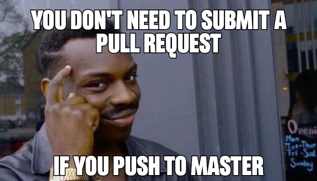

After hours of work, you finally get there. Your code is ready. Time to submit a Pull Request (PR) and get your baby reviewed. There is a PR template to fill... Ufff, that's annoying! Please, don't waste my time with this stuff and just look at my code!!! 

Let's be honest: we have been there more than once. PRs with a poorly filled template, or (even worst) no template and an extremely useless description. "Add this". "Fix that". 

But we know it is not the right way to ship our code. In this article, I want to point out the importance of providing an amazing PR, with a complete and useful description, and all the information the reviewers will need to provide great feedback. No templates here, or rules to follow. **My goal is to inspire you to give some love to your PR**.


## Why your PR deserves some love
You may wonder why you should spend time crafting a PR full of love. The reason is quite simple: **your work, your reviewers, and you deserve it!**

### Your work deserves it
Every line of code, every commit, every test is a unique piece of work. It deserves the best possible presentation. What's the point of crafting something without put some care in its presentation? Give some love to your work presenting it in a way other people will appreciate it too.

Image to visit an art gallery. You have the chance to quickly chat with the author of the masterpiece you are observing and that you would like to buy: the amazing portrait of a dead tomato on a sunny beach. So full of meaning! You ask the author some information on how he had such an inspiration, and he answers: "Meh, I took some colours and I panted that". Not the best way to sell the artwork, right?

With your PR is the same story: you cannot pretend others to appreciate your work if you don't spend some time **properly presenting it**.

### Your reviewers deserve it
Put yourself in the shoes of the reviewers. 

Oh, a notification! Someone requested a review from me, great! Let me check...

* 20 new files
* 15 modifications
* 5 files deleted
* Title: updated module
* Description: Updated the module to implement ticket 1234.

What the f**k...

Back to the art gallery example. You are the critic that should provide a review of that famous "Sad Tomato in a Happy Place", the masterpiece everyone is talking about. You go around the art gallery looking for it, and you find the artwork still in it's packaging with a small label saying: "tomato". To review it you would need to unpack the artwork, ask around for information about it, ask the author about his choices about the colours, etc. Doesn't sound appealing, right?

Remember that **the time of your reviewers is as much as valuable as yours**. Also, it is quite hard to provide a proper review without having some context. **Help your reviewers help you**: give some love to your PR with a meaningful title and a proper description of what you have done. We will get back on this later...

### You deserve it
You spent hours if not days working on a task. Several commits, tests, failures, and successes. Do you want to submit a PR without showing the care you put in your work? Without explaining the choices you made after several thoughts?

Back to the art gallery example. This time, you are the author of "Sad Tomato in a Happy Place". It has been not easy to come up with such a complex masterpiece, for sure. You want people to appreciate your work, understand how hard you worked on that, all the passion you put in it. I think you won't put the artwork in a dark corner, without a frame, just above the fire extinguisher, and near the ladies bathroom. You want to put it under the best possible light, with an amazing frame and in the most important place of the gallery.

You want to do the same with your PR. You deserve that your reviewers can **understand and appreciate** your work! Their review will be much better, and this will help YOU in providing even more value. As I said before: **help them help YOU**.

## How to give some love to your PR
I think now we all agree that our PR deserves some love. How to do that? Well, it doesn't require a lot of hard work, just to **pay attention to details**.



### Keep it small
Please, **keep your PR as small as possible**. I understand that sometimes the task/feature requires a lot of work, but if it is possible please split it in smaller and very focused PRs. It will be easier for you to focus on that specific part of the business logic, and your reviewers will provide a better review. That's a lot easier to understand the logic and provide feedback when you don't have to look at 20 files.

### Give some ❤️ to commits too
Commits are the building blocks of your PR, and **they deserve some love as well**. When you commit, provide useful information on what the commit is about. I won't spend much time on this topic since you can find plenty of articles with good tips on the internet. I like the suggestions from Chris Beams that he describes in [this](https://chris.beams.io/posts/git-commit/#imperative) nice article.

### First things first: the title
The title of the PR is the first thing your reviewers will see and **can provide a lot of useful information**. Is it a feature? A fix? A simple chore? State that clearly in the title along with few words on the task the PR is focused on.

```
Chore: upgrade log4j to version 2.3.4
```

is a better title than

```
upgrade package
```

don't you think?

### Provide a good description
After the title, it comes the description. It is not important how you structure it, it can be a list of bullet points, a checklist, an informal description, a photo romance... what is important are **the information you provide**. In my humble opinion, the description should comprehend:

* **Topic**: what are you trying to accomplish with this PR? How are you achieving your goal?
* **Motivation**: why are you submitting this PR? If it is related to a ticket/task, provide a link to it.
* **Breaking changes**: does this PR introduces some breaking changes? Why? Your reviewers may put extra attention if they know this PR will potentially break stuff.
* **Additional information**: is there any other information useful to know for the reviewer? An example may be the reasons behind a particular decision on a piece of code that may sound weird.

Let me be clear and repeat it: it is not important the format, but the quality of information you provide with your description. If you can provide high-quality information in 3 lines of text, well, great!

### Make tests first-class citizens
Did you test your PR? I assume (*hope*) you are used to doing it. Describe briefly what kind of tests you did, and if it is appropriate what is required to test the PR. I know that tests maybe are visible in the file list, but I think your reviewers will be happy to have a **summary**.

Also, a PR could be not just code that you can test explicitly. Suppose you added some scripts to the repo. The best thing you can do is to write the command you used to test it and copy & paste the output. This is just an example, I am sure you can find others.

### Highlight dependencies
Your PR may have dependencies as well as other tasks that should be done *after* it is merged. It can be another PR that should be merged before this one, a value that should be updated in the database, or some resources that should be cleaned because no more needed after the PR is merged. You should always **state clearly the dependencies of your PR**. Why? Well, first of all, this will be a good reminder for you! It will be also helpful to your reviewers, that will validate them as well as the PR itself.

## Conclusion
Ok, guys, that's it. I said it already, I didn't want to provide a set of rules on how to do a PR. These are just some suggestion that I hope will be useful to you. Time to get back to your PRs and give them some ❤️!

*photo by*  <a style="background-color:black;color:white;text-decoration:none;padding:4px 6px;font-family:-apple-system, BlinkMacSystemFont, &quot;San Francisco&quot;, &quot;Helvetica Neue&quot;, Helvetica, Ubuntu, Roboto, Noto, &quot;Segoe UI&quot;, Arial, sans-serif;font-size:12px;font-weight:bold;line-height:1.2;display:inline-block;border-radius:3px" href="https://unsplash.com/@jamie452?utm_source=unsplash&utm_medium=referral&utm_content=creditCopyText" title="Download free do whatever you want high-resolution photos from Jamie Street"><span style="display:inline-block;padding:2px 3px"><svg xmlns="http://www.w3.org/2000/svg" style="height:12px;width:auto;position:relative;vertical-align:middle;top:-2px;fill:white" viewBox="0 0 32 32"><title>unsplash-logo</title><path d="M10 9V0h12v9H10zm12 5h10v18H0V14h10v9h12v-9z"></path></svg></span><span style="display:inline-block;padding:2px 3px">Jamie Street</span></a>
